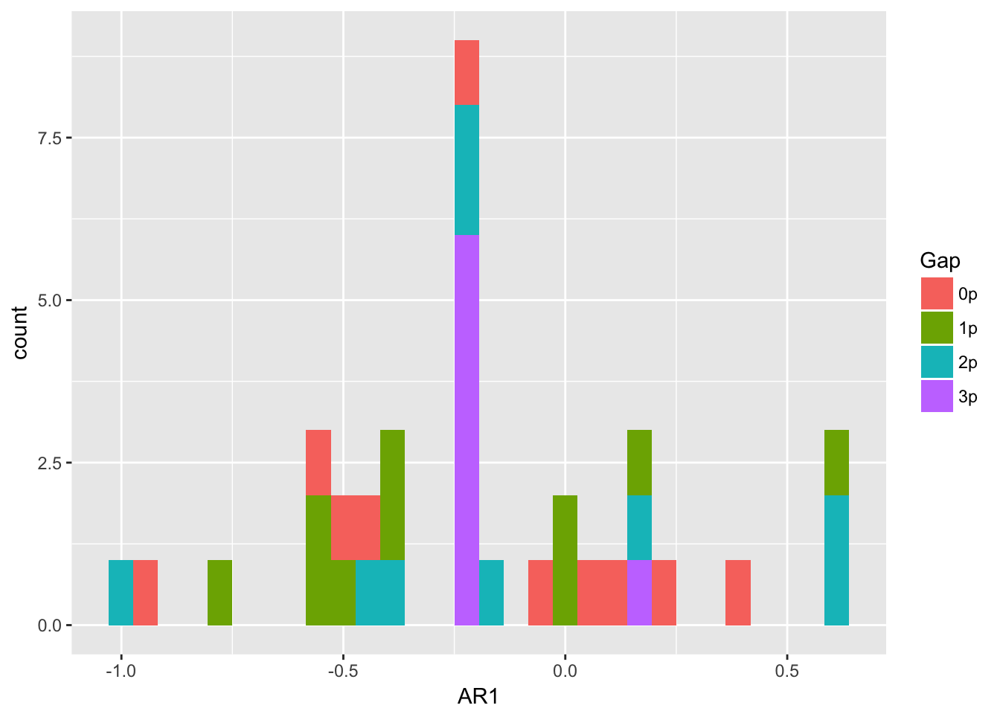
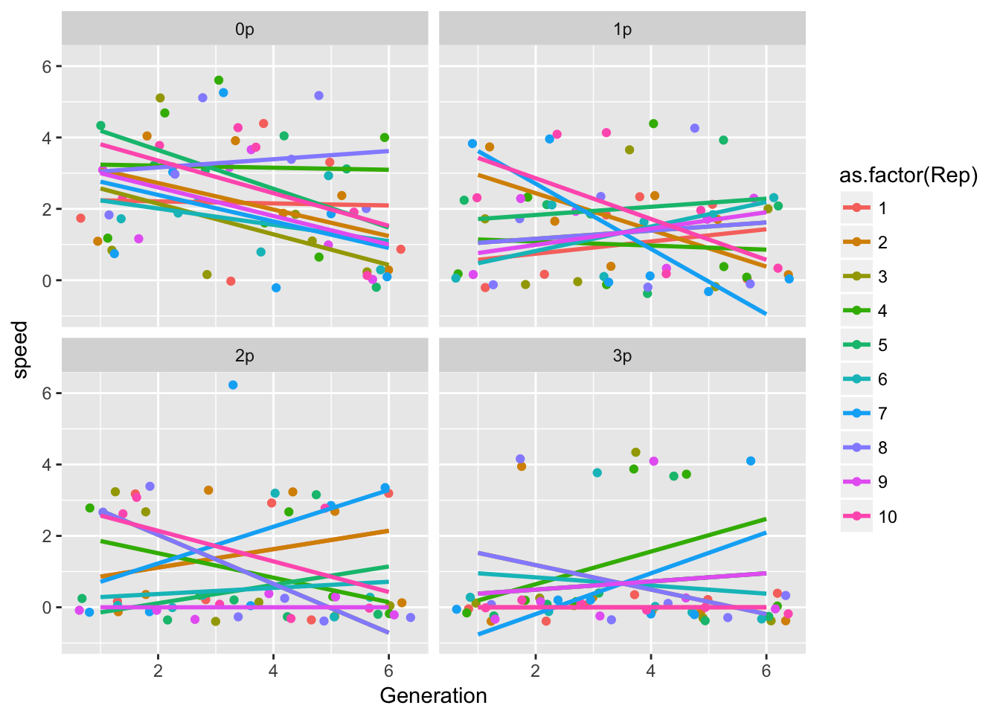
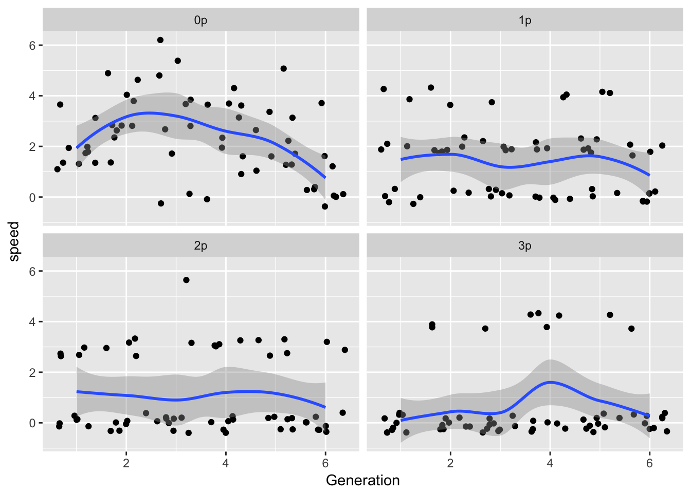
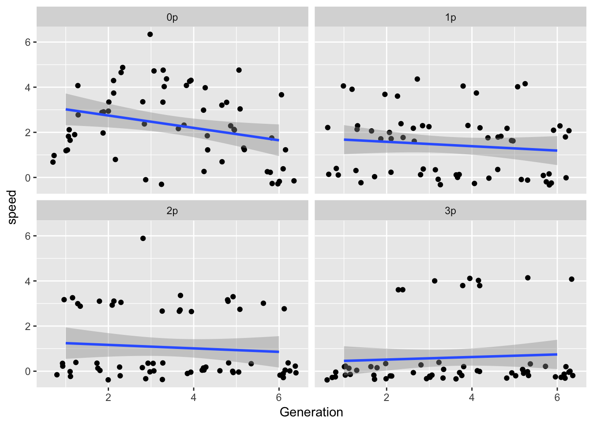

# 5 May 2017


## Calculate Ler spread rates
First we look at furthest distance reached.

```r
Ler_furthest_C <- filter(popLer, Treatment == "C") %>%
  group_by(Gap, Rep, Generation) %>%
  summarise(Furthest = max(Pot))
```

Now calculate per-generation spread rates

```r
# The "default" argument to lag() replaces the leading NA with the specified value
gen_spread <- group_by(Ler_furthest_C, Gap, Rep) %>%
  mutate(speed =  Furthest - lag(Furthest, default = 0),
         speed_m1 = lag(speed))
```

Hmm, there is one case (rep 8, 3p gap) where the forward pot seems to go extinct, resulting in a negative speed. Need to check the original data, but for now let's just set that to zero.


```r
gen_spread <- within(gen_spread, speed[speed < 0] <- 0)
gen_spread <- within(gen_spread, speed_m1[speed_m1 < 0] <- 0)
```

Look at autocorrelation:

```r
spread_AR <- group_by(gen_spread, Gap, Rep) %>% 
  summarise(AR1 = cor(speed, speed_m1, use = "complete"))
ggplot(spread_AR, aes(x = AR1)) + geom_histogram(aes(fill = Gap))
```

```
`stat_bin()` using `bins = 30`. Pick better value with `binwidth`.
```


ALthough it looks like a bias towards negative values, I think that's mostly from the 3p gaps, where the pattern 0-4-0 will be common.

Look at trends by rep:

```r
ggplot(gen_spread, aes(x = Generation, y = speed, color = as.factor(Rep))) +
  geom_point(position = "jitter") + 
  geom_smooth(method = "lm", se = FALSE) + 
  facet_wrap(~Gap)
```



```r
ggplot(gen_spread, aes(x = Generation, y = speed)) +
  geom_point(position = "jitter") + 
  geom_smooth() + 
  facet_wrap(~Gap)
```



```r
ggplot(gen_spread, aes(x = Generation, y = speed)) +
  geom_point(position = "jitter") + 
  geom_smooth(method = "gam", method.args = list(k = 4)) + 
  facet_wrap(~Gap)
```



```r
summary(lm(speed ~ Generation, data = filter(gen_spread, Gap == "0p")))
```

```

Call:
lm(formula = speed ~ Generation, data = filter(gen_spread, Gap == 
    "0p"))

Residuals:
    Min      1Q  Median      3Q     Max 
-2.4705 -1.3090  0.0295  1.1224  3.5295 

Coefficients:
            Estimate Std. Error t value Pr(>|t|)    
(Intercept)   3.2933     0.4609   7.145 1.67e-09 ***
Generation   -0.2743     0.1183  -2.318    0.024 *  
---
Signif. codes:  0 '***' 0.001 '**' 0.01 '*' 0.05 '.' 0.1 ' ' 1

Residual standard error: 1.566 on 58 degrees of freedom
Multiple R-squared:  0.08476,	Adjusted R-squared:  0.06898 
F-statistic: 5.371 on 1 and 58 DF,  p-value: 0.02402
```

```r
library(mgcv)
summary(gam(speed ~ s(Generation, k = 4), data = filter(gen_spread, Gap == "0p")))
```

```

Family: gaussian 
Link function: identity 

Formula:
speed ~ s(Generation, k = 4)

Parametric coefficients:
            Estimate Std. Error t value Pr(>|t|)    
(Intercept)   2.3333     0.1828   12.77   <2e-16 ***
---
Signif. codes:  0 '***' 0.001 '**' 0.01 '*' 0.05 '.' 0.1 ' ' 1

Approximate significance of smooth terms:
                edf Ref.df     F  p-value    
s(Generation) 2.223  2.597 7.506 0.000784 ***
---
Signif. codes:  0 '***' 0.001 '**' 0.01 '*' 0.05 '.' 0.1 ' ' 1

R-sq.(adj) =  0.239   Deviance explained = 26.7%
GCV = 2.1184  Scale est. = 2.0046    n = 60
```

```r
plot(gam(speed ~ s(Generation, k = 4), data = filter(gen_spread, Gap == "0p")))
```


```r
anova(gam(speed ~ s(Generation, k = 4), data = filter(gen_spread, Gap == "0p")), 
      gam(speed ~ Generation, data = filter(gen_spread, Gap == "0p")),
      test = "Chisq") 
```

```
Analysis of Deviance Table

Model 1: speed ~ s(Generation, k = 4)
Model 2: speed ~ Generation
  Resid. Df Resid. Dev      Df Deviance  Pr(>Chi)    
1    56.403     113.82                               
2    58.000     142.17 -1.5975  -28.351 0.0004792 ***
---
Signif. codes:  0 '***' 0.001 '**' 0.01 '*' 0.05 '.' 0.1 ' ' 1
```

So there looks to be some nonstationarity in the continuous runways, with the speed peaking in generation 3. The initial increase makes sense, but the decline does not.
