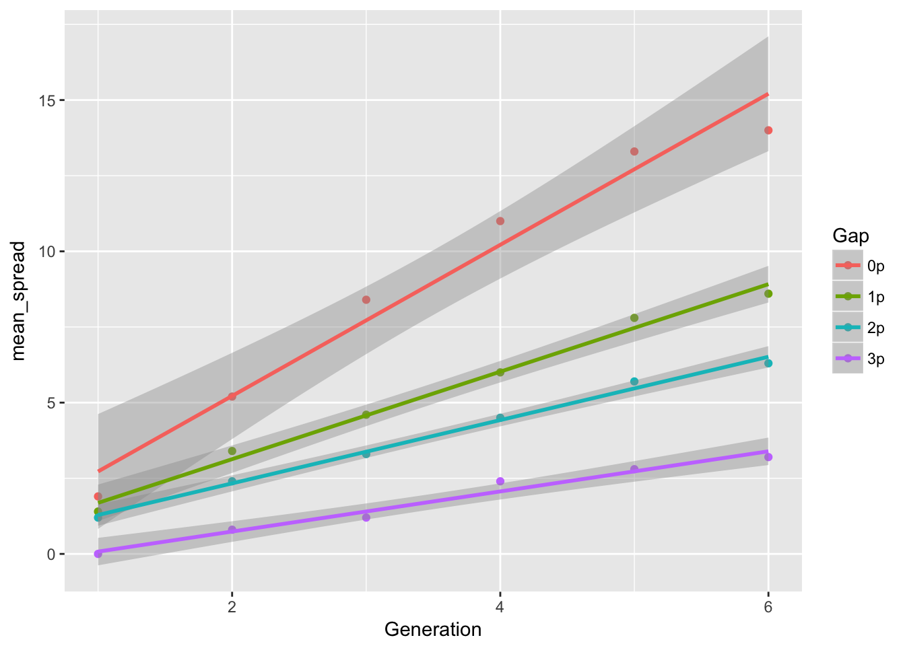
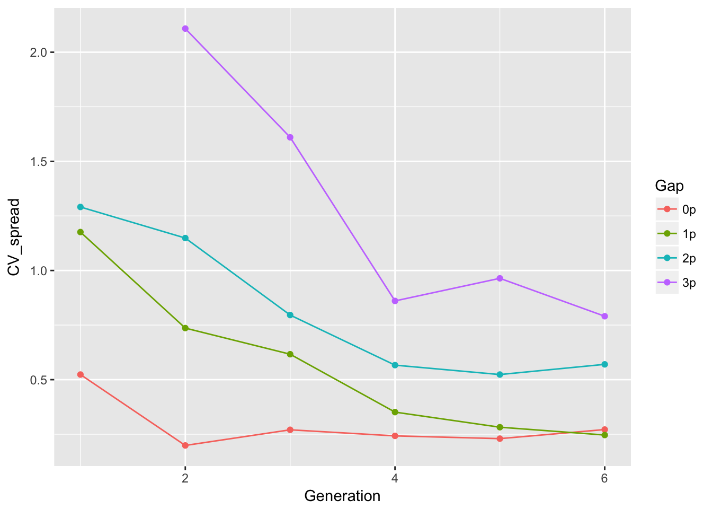
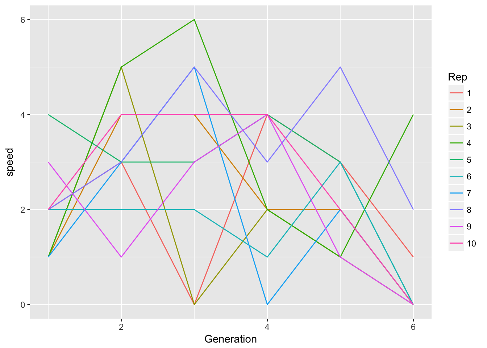

# 8 May 2027


## Dispersal evolution in beetle experiments
Just read the papers from Brett's and TEX's labs. As Jen said, their "no evolution" treatment was spatial shuffling, so didn't maintain the original genetic composition.

They both found increased mean and increased variance with evolution. Both found increased dispersal ability at the edge of the evolving populations; the flour beetle experiment also found a *reduction* in low-density growth rate.

The effects on dispersal are explained as spatial sorting; the growth rate effects are hypothesized to represent "gene surfing", whereby deleterious alleles exposed by founder effects at the leading edge are carried forward by the fact that next generation's leading edge is primarily founded by this generation's leading edge.

The flour beetle experiment found that the among-replicate variance in cumulative spread grew faster than linearly. This is consistent with among-replicate differences in mean speeds (which would generate a quadratic growth in variance through time). This pattern was found in both treatments, suggesting that it's not just a consequence of founder effects at the leading edge. Perhaps it represents founder effects in the initial establishment from the stock population (each replicate was founded by 20 individuals). The bean beetle experiment doesn't show this graph but found strong support for a random effect for replicate speed in their model for cumulative spread.

So a couple of things to do (both for Ler and the evolution experiments):

- Plot mean and variance of cumulative spread against time
- Fit the bean beetle model (as a first approximation to be quick I can treat rep as a fixed effect).

## Ler cumulative spread
To facilitate the above analyses, I have modified the script for popLer to make categorical versions of Generation and Replicate (Gen and Rep, respectively), and put the guts of last time's data manipulation into a munge script, which creates `LerC_spread` containing cumulative and per-generation spread for the C treatment replicates.

Let's calculate the means and variances of cumulative spread:

```r
cum_spread_stats <- group_by(LerC_spread, Gap, Gen, Generation) %>%
  summarise(mean_spread = mean(Furthest),
            var_spread = var(Furthest),
            CV_spread = sqrt(var_spread)/mean_spread
  )
```

And now plot the results:

```r
ggplot(aes(x = Generation, y = mean_spread, color = Gap), data = cum_spread_stats) +
  geom_point() + geom_smooth(method = "lm")
```



```r
ggplot(aes(x = Generation, y = var_spread, color = Gap), data = cum_spread_stats) +
  geom_point() + geom_line()
```


```r
ggplot(aes(x = Generation, y = CV_spread, color = Gap), data = cum_spread_stats) +
  geom_point() + geom_line()
```

```
Warning: Removed 1 rows containing missing values (geom_point).
```

```
Warning: Removed 1 rows containing missing values (geom_path).
```



The linear approximation to mean spread is pretty good, although we see a dip in generation 6, as expected from the reduced seed production, and even without gen 6, the continuous runways seem to be decelerating. The ranking between landscapes makes sense. The variances are rather more over the map, although we don't have confidence intervals on them. But exept for 1-pot gaps, we can squint and imagine that the variances are linear in time. Note, however, that with only 6 generations we're not going to easily detect nonlinearities. I don't know that the CVs tell us much.

Probably the best way to get CIs is to bootstrap replicates.

Let's try fitting a model. We'll need to add a lag of cumulative spread.

```r
LerC_spread <- mutate(LerC_spread, 
                      Furthestm1 = lag(Furthest, default = 0))
m1 <- lm(Furthest ~ Generation + Rep + Generation:Rep + Furthestm1, 
         data = filter(LerC_spread, Gap == "0p"))
summary(m1)
```

```

Call:
lm(formula = Furthest ~ Generation + Rep + Generation:Rep + Furthestm1, 
    data = filter(LerC_spread, Gap == "0p"))

Residuals:
     Min       1Q   Median       3Q      Max 
-2.08017 -0.73937  0.03383  0.78409  2.54087 

Coefficients:
                 Estimate Std. Error t value Pr(>|t|)    
(Intercept)      -0.26479    1.38823  -0.191 0.849720    
Generation        2.22470    0.58884   3.778 0.000528 ***
Rep2              0.42109    1.81056   0.233 0.817308    
Rep3              1.70697    1.81500   0.940 0.352762    
Rep4             -0.36309    1.82680  -0.199 0.843484    
Rep5              1.94739    1.80616   1.078 0.287571    
Rep6              0.91400    1.80930   0.505 0.616284    
Rep7              0.73685    1.80286   0.409 0.684987    
Rep8             -1.47533    1.86173  -0.792 0.432890    
Rep9              1.19824    1.80269   0.665 0.510156    
Rep10             0.63691    1.82680   0.349 0.729229    
Furthestm1        0.02636    0.21151   0.125 0.901446    
Generation:Rep2   0.15787    0.47548   0.332 0.741652    
Generation:Rep3  -0.81727    0.47167  -1.733 0.091045 .  
Generation:Rep4   1.08491    0.51942   2.089 0.043312 *  
Generation:Rep5   0.51499    0.51405   1.002 0.322606    
Generation:Rep6  -0.58945    0.47054  -1.253 0.217770    
Generation:Rep7  -0.25940    0.46323  -0.560 0.578691    
Generation:Rep8   1.45031    0.54307   2.671 0.010986 *  
Generation:Rep9  -0.20452    0.46429  -0.440 0.662009    
Generation:Rep10  0.65634    0.51942   1.264 0.213878    
---
Signif. codes:  0 '***' 0.001 '**' 0.01 '*' 0.05 '.' 0.1 ' ' 1

Residual standard error: 1.369 on 39 degrees of freedom
Multiple R-squared:  0.9503,	Adjusted R-squared:  0.9248 
F-statistic: 37.25 on 20 and 39 DF,  p-value: < 2.2e-16
```

```r
car::Anova(m1)
```

```
Anova Table (Type II tests)

Response: Furthest
               Sum Sq Df F value  Pr(>F)  
Generation      5.178  1  2.7619 0.10455  
Rep            32.986  9  1.9550 0.07214 .
Furthestm1      0.029  1  0.0155 0.90145  
Generation:Rep 35.750  9  2.1188 0.05125 .
Residuals      73.114 39                  
---
Signif. codes:  0 '***' 0.001 '**' 0.01 '*' 0.05 '.' 0.1 ' ' 1
```
This is a little curious-- I wasn't expecting the reps to have different speeds, except as a side effect of autocorrelation. Let's try a few other models:

```r
m2 <- lm(Furthest ~ Generation + Rep + Generation:Rep, 
         data = filter(LerC_spread, Gap == "0p"))
m3 <- lm(Furthest ~ Generation + Furthestm1, data = filter(LerC_spread, Gap == "0p"))
anova(m1, m2, m3)
```

```
Analysis of Variance Table

Model 1: Furthest ~ Generation + Rep + Generation:Rep + Furthestm1
Model 2: Furthest ~ Generation + Rep + Generation:Rep
Model 3: Furthest ~ Generation + Furthestm1
  Res.Df     RSS  Df Sum of Sq      F  Pr(>F)  
1     39  73.114                               
2     40  73.143  -1    -0.029 0.0155 0.90145  
3     57 141.849 -17   -68.707 2.1558 0.02383 *
---
Signif. codes:  0 '***' 0.001 '**' 0.01 '*' 0.05 '.' 0.1 ' ' 1
```
Hmm, they really do seem to have different slopes. But we have not yet accounted for time-varying speeds. I don't see how to do that in this context; let's look at per-generation speeds instead:

```r
m11 <- lm(speed ~ Gen + Rep, data = filter(LerC_spread, Gap == "0p"))
summary(m11)
```

```

Call:
lm(formula = speed ~ Gen + Rep, data = filter(LerC_spread, Gap == 
    "0p"))

Residuals:
    Min      1Q  Median      3Q     Max 
-3.0333 -0.7083 -0.0500  0.8667  2.5333 

Coefficients:
              Estimate Std. Error t value Pr(>|t|)  
(Intercept)  1.733e+00  6.973e-01   2.486   0.0167 *
Gen2         1.400e+00  6.237e-01   2.245   0.0298 *
Gen3         1.300e+00  6.237e-01   2.084   0.0428 *
Gen4         7.000e-01  6.237e-01   1.122   0.2677  
Gen5         4.000e-01  6.237e-01   0.641   0.5246  
Gen6        -1.200e+00  6.237e-01  -1.924   0.0607 .
Rep2         7.525e-16  8.052e-01   0.000   1.0000  
Rep3        -6.667e-01  8.052e-01  -0.828   0.4121  
Rep4         1.000e+00  8.052e-01   1.242   0.2207  
Rep5         6.667e-01  8.052e-01   0.828   0.4121  
Rep6        -5.000e-01  8.052e-01  -0.621   0.5378  
Rep7        -3.333e-01  8.052e-01  -0.414   0.6809  
Rep8         1.167e+00  8.052e-01   1.449   0.1543  
Rep9        -1.667e-01  8.052e-01  -0.207   0.8370  
Rep10        5.000e-01  8.052e-01   0.621   0.5378  
---
Signif. codes:  0 '***' 0.001 '**' 0.01 '*' 0.05 '.' 0.1 ' ' 1

Residual standard error: 1.395 on 45 degrees of freedom
Multiple R-squared:  0.4365,	Adjusted R-squared:  0.2612 
F-statistic:  2.49 on 14 and 45 DF,  p-value: 0.01046
```

```r
car::Anova(m11)
```

```
Anova Table (Type II tests)

Response: speed
          Sum Sq Df F value   Pr(>F)   
Gen       46.133  5  4.7433 0.001451 **
Rep       21.667  9  1.2376 0.297021   
Residuals 87.533 45                    
---
Signif. codes:  0 '***' 0.001 '**' 0.01 '*' 0.05 '.' 0.1 ' ' 1
```
Well this is confusing! If the per-generation speeds don't differ among reps, how can the slopes of cumulative spread do so? Let's look at some plots:

```r
ggplot(aes(x = Generation, y = Furthest, color = Rep), 
       data = filter(LerC_spread, Gap == "0p")) +
  geom_point() + geom_smooth(method = "lm")
```


```r
ggplot(aes(x = Generation, y = speed, color = Rep), 
       data = filter(LerC_spread, Gap == "0p")) +
  geom_line()
```


Let's look for autocorrelation in speed.

```r
m12 <- lm(speed ~ Gen + Rep + speed_m1, data = filter(LerC_spread, Gap == "0p"))
summary(m12)
```

```

Call:
lm(formula = speed ~ Gen + Rep + speed_m1, data = filter(LerC_spread, 
    Gap == "0p"))

Residuals:
    Min      1Q  Median      3Q     Max 
-2.9931 -0.5869 -0.0863  0.7257  2.5069 

Coefficients:
            Estimate Std. Error t value Pr(>|t|)    
(Intercept)   3.6162     0.7801   4.635  4.8e-05 ***
Gen3          0.3577     0.6601   0.542 0.591277    
Gen4         -0.2750     0.6549  -0.420 0.677148    
Gen5         -0.7711     0.6313  -1.222 0.230033    
Gen6         -2.4692     0.6246  -3.953 0.000357 ***
Rep2          0.2654     0.8793   0.302 0.764579    
Rep3         -0.7962     0.8839  -0.901 0.373882    
Rep4          1.5962     0.8839   1.806 0.079554 .  
Rep5          0.7270     0.8930   0.814 0.421127    
Rep6         -0.7308     0.8810  -0.829 0.412469    
Rep7         -0.2654     0.8793  -0.302 0.764579    
Rep8          1.7923     0.8992   1.993 0.054082 .  
Rep9         -0.4000     0.8787  -0.455 0.651778    
Rep10         0.8616     0.8879   0.970 0.338540    
speed_m1     -0.3270     0.1591  -2.055 0.047378 *  
---
Signif. codes:  0 '***' 0.001 '**' 0.01 '*' 0.05 '.' 0.1 ' ' 1

Residual standard error: 1.389 on 35 degrees of freedom
  (10 observations deleted due to missingness)
Multiple R-squared:  0.5314,	Adjusted R-squared:  0.3439 
F-statistic: 2.835 on 14 and 35 DF,  p-value: 0.006219
```

```r
car::Anova(m12)
```

```
Anova Table (Type II tests)

Response: speed
          Sum Sq Df F value    Pr(>F)    
Gen       47.871  4  6.1995 0.0007015 ***
Rep       32.146  9  1.8502 0.0935244 .  
speed_m1   8.154  1  4.2240 0.0473783 *  
Residuals 67.566 35                      
---
Signif. codes:  0 '***' 0.001 '**' 0.01 '*' 0.05 '.' 0.1 ' ' 1
```
Aha! there is negative autocorrelation in speed (evidently it was obscured by the time-dependent patterns in the univariate analysis I did last week). A potential explanation for this could be partial "pushing" by older pots, so that a replicate that gets extra far this generation has less pushing next generation. Alternatively, it could reflect a correlation between distance spread and the number of plants in the furthest pot.

Let's do one more analysis with a quadratic of time, so we can interact it with Rep:

```r
m13 <- lm(speed ~ poly(Generation, 2) * Rep + speed_m1, 
          data = filter(LerC_spread, Gap == "0p"))
summary(m13)
```

```

Call:
lm(formula = speed ~ poly(Generation, 2) * Rep + speed_m1, data = filter(LerC_spread, 
    Gap == "0p"))

Residuals:
     Min       1Q   Median       3Q      Max 
-2.14668 -0.47051  0.02562  0.52439  2.46495 

Coefficients:
                             Estimate Std. Error t value Pr(>|t|)   
(Intercept)                 3.054e+00  9.512e-01   3.211   0.0046 **
poly(Generation, 2)1        1.990e+00  7.837e+00   0.254   0.8023   
poly(Generation, 2)2       -2.395e+00  7.431e+00  -0.322   0.7507   
Rep2                        4.945e-01  1.154e+00   0.429   0.6730   
Rep3                        1.295e-01  1.159e+00   0.112   0.9122   
Rep4                        2.280e+00  1.154e+00   1.976   0.0629 . 
Rep5                        6.689e-01  1.166e+00   0.574   0.5730   
Rep6                       -6.265e-01  1.150e+00  -0.545   0.5922   
Rep7                        1.540e-02  1.160e+00   0.013   0.9895   
Rep8                        1.467e+00  1.155e+00   1.270   0.2194   
Rep9                       -9.598e-01  1.150e+00  -0.835   0.4142   
Rep10                       8.141e-01  1.148e+00   0.709   0.4869   
speed_m1                   -4.215e-01  1.982e-01  -2.126   0.0468 * 
poly(Generation, 2)1:Rep2  -1.014e+01  1.115e+01  -0.910   0.3745   
poly(Generation, 2)2:Rep2  -5.019e+00  1.087e+01  -0.462   0.6495   
poly(Generation, 2)1:Rep3  -1.910e+01  1.109e+01  -1.722   0.1012   
poly(Generation, 2)2:Rep3   7.551e+00  1.057e+01   0.714   0.4838   
poly(Generation, 2)1:Rep4  -1.356e+01  1.122e+01  -1.208   0.2417   
poly(Generation, 2)2:Rep4   3.330e+00  1.155e+01   0.288   0.7762   
poly(Generation, 2)1:Rep5  -3.324e+00  1.110e+01  -0.299   0.7678   
poly(Generation, 2)2:Rep5  -8.064e+00  1.046e+01  -0.771   0.4502   
poly(Generation, 2)1:Rep6  -3.761e+00  1.109e+01  -0.339   0.7382   
poly(Generation, 2)2:Rep6   5.375e-14  1.044e+01   0.000   1.0000   
poly(Generation, 2)1:Rep7  -1.072e+01  1.111e+01  -0.965   0.3467   
poly(Generation, 2)2:Rep7  -3.057e+00  1.080e+01  -0.283   0.7801   
poly(Generation, 2)1:Rep8   5.176e+00  1.121e+01   0.462   0.6496   
poly(Generation, 2)2:Rep8  -7.049e+00  1.053e+01  -0.669   0.5114   
poly(Generation, 2)1:Rep9   2.805e+00  1.108e+01   0.253   0.8028   
poly(Generation, 2)2:Rep9  -1.315e+01  1.057e+01  -1.244   0.2287   
poly(Generation, 2)1:Rep10 -6.363e+00  1.115e+01  -0.571   0.5750   
poly(Generation, 2)2:Rep10 -1.054e+01  1.087e+01  -0.970   0.3444   
---
Signif. codes:  0 '***' 0.001 '**' 0.01 '*' 0.05 '.' 0.1 ' ' 1

Residual standard error: 1.43 on 19 degrees of freedom
  (10 observations deleted due to missingness)
Multiple R-squared:  0.7304,	Adjusted R-squared:  0.3048 
F-statistic: 1.716 on 30 and 19 DF,  p-value: 0.1102
```

```r
car::Anova(m13)
```

```
Anova Table (Type II tests)

Response: speed
                        Sum Sq Df F value    Pr(>F)    
poly(Generation, 2)     46.959  2 11.4785 0.0005389 ***
Rep                     32.487  9  1.7646 0.1422649    
speed_m1                 9.249  1  4.5217 0.0467938 *  
poly(Generation, 2):Rep 29.613 18  0.8043 0.6761230    
Residuals               38.865 19                      
---
Signif. codes:  0 '***' 0.001 '**' 0.01 '*' 0.05 '.' 0.1 ' ' 1
```
Drop the interaction:

```r
m14 <- lm(speed ~ poly(Generation, 2) + Rep + speed_m1, 
          data = filter(LerC_spread, Gap == "0p"))
summary(m14)
```

```

Call:
lm(formula = speed ~ poly(Generation, 2) + Rep + speed_m1, data = filter(LerC_spread, 
    Gap == "0p"))

Residuals:
     Min       1Q   Median       3Q      Max 
-2.89320 -0.68615 -0.06304  0.68486  2.49198 

Coefficients:
                     Estimate Std. Error t value Pr(>|t|)    
(Intercept)            2.9649     0.7018   4.225  0.00015 ***
poly(Generation, 2)1  -4.2553     2.4272  -1.753  0.08786 .  
poly(Generation, 2)2  -5.5072     2.3684  -2.325  0.02565 *  
Rep2                   0.2662     0.8609   0.309  0.75893    
Rep3                  -0.7985     0.8653  -0.923  0.36206    
Rep4                   1.5985     0.8653   1.847  0.07269 .  
Rep5                   0.7309     0.8738   0.836  0.40831    
Rep6                  -0.7323     0.8626  -0.849  0.40133    
Rep7                  -0.2662     0.8609  -0.309  0.75893    
Rep8                   1.7970     0.8797   2.043  0.04824 *  
Rep9                  -0.4000     0.8604  -0.465  0.64473    
Rep10                  0.8647     0.8690   0.995  0.32619    
speed_m1              -0.3309     0.1526  -2.169  0.03660 *  
---
Signif. codes:  0 '***' 0.001 '**' 0.01 '*' 0.05 '.' 0.1 ' ' 1

Residual standard error: 1.36 on 37 degrees of freedom
  (10 observations deleted due to missingness)
Multiple R-squared:  0.5251,	Adjusted R-squared:  0.371 
F-statistic: 3.409 on 12 and 37 DF,  p-value: 0.002013
```

```r
car::Anova(m14)
```

```
Anova Table (Type II tests)

Response: speed
                    Sum Sq Df F value    Pr(>F)    
poly(Generation, 2) 46.959  2 12.6865 6.372e-05 ***
Rep                 32.487  9  1.9504   0.07456 .  
speed_m1             8.705  1  4.7036   0.03660 *  
Residuals           68.478 37                      
---
Signif. codes:  0 '***' 0.001 '**' 0.01 '*' 0.05 '.' 0.1 ' ' 1
```
So, in conclusion: weak evidence for among-Rep differences in means, but strong evidence for negative autocorrelation. Note that this autocorrelation should act to slow the rate at which the variance in cumulative spread increases with time.

Let's check out the other landscapes:

```r
m24 <- lm(speed ~ Gen + Rep + speed_m1, 
          data = filter(LerC_spread, Gap == "1p"))
m34 <- lm(speed ~ Gen + Rep + speed_m1, 
          data = filter(LerC_spread, Gap == "2p"))
m44 <- lm(speed ~ Gen + Rep + speed_m1, 
          data = filter(LerC_spread, Gap == "3p"))
summary(m24)
```

```

Call:
lm(formula = speed ~ Gen + Rep + speed_m1, data = filter(LerC_spread, 
    Gap == "1p"))

Residuals:
    Min      1Q  Median      3Q     Max 
-1.9393 -1.0203 -0.2807  0.7435  3.0813 

Coefficients:
              Estimate Std. Error t value Pr(>|t|)  
(Intercept)  1.939e+00  8.046e-01   2.410   0.0213 *
Gen3        -6.966e-01  6.728e-01  -1.035   0.3076  
Gen4        -6.345e-01  6.671e-01  -0.951   0.3481  
Gen5        -2.000e-01  6.664e-01  -0.300   0.7658  
Gen6        -1.131e+00  6.692e-01  -1.690   0.0999 .
Rep2         1.379e-01  9.504e-01   0.145   0.8855  
Rep3        -1.100e-15  9.424e-01   0.000   1.0000  
Rep4        -1.008e-15  9.424e-01   0.000   1.0000  
Rep5         9.379e-01  9.504e-01   0.987   0.3305  
Rep6         4.000e-01  9.424e-01   0.424   0.6738  
Rep7        -3.310e-01  9.444e-01  -0.351   0.7280  
Rep8         4.690e-01  9.444e-01   0.497   0.6226  
Rep9         4.000e-01  9.424e-01   0.424   0.6738  
Rep10        1.007e+00  9.604e-01   1.048   0.3017  
speed_m1    -1.724e-01  1.543e-01  -1.117   0.2715  
---
Signif. codes:  0 '***' 0.001 '**' 0.01 '*' 0.05 '.' 0.1 ' ' 1

Residual standard error: 1.49 on 35 degrees of freedom
  (10 observations deleted due to missingness)
Multiple R-squared:  0.1932,	Adjusted R-squared:  -0.1295 
F-statistic: 0.5988 on 14 and 35 DF,  p-value: 0.8474
```

```r
summary(m34)
```

```

Call:
lm(formula = speed ~ Gen + Rep + speed_m1, data = filter(LerC_spread, 
    Gap == "2p"))

Residuals:
    Min      1Q  Median      3Q     Max 
-2.9139 -0.8927 -0.3292  0.9515  3.3861 

Coefficients:
              Estimate Std. Error t value Pr(>|t|)  
(Intercept)  2.206e+00  8.573e-01   2.573   0.0145 *
Gen3        -3.000e-01  7.061e-01  -0.425   0.6736  
Gen4        -5.386e-02  7.076e-01  -0.076   0.9398  
Gen5         3.010e-16  7.061e-01   0.000   1.0000  
Gen6        -6.000e-01  7.061e-01  -0.850   0.4013  
Rep2         1.077e-01  1.003e+00   0.107   0.9151  
Rep3        -1.200e+00  9.986e-01  -1.202   0.2376  
Rep4        -1.200e+00  9.986e-01  -1.202   0.2376  
Rep5        -1.308e+00  1.003e+00  -1.304   0.2007  
Rep6        -1.308e+00  1.003e+00  -1.304   0.2007  
Rep7         7.077e-01  1.003e+00   0.706   0.4850  
Rep8        -1.200e+00  9.986e-01  -1.202   0.2376  
Rep9        -2.015e+00  1.015e+00  -1.985   0.0550 .
Rep10       -4.923e-01  1.003e+00  -0.491   0.6266  
speed_m1    -1.795e-01  1.524e-01  -1.178   0.2469  
---
Signif. codes:  0 '***' 0.001 '**' 0.01 '*' 0.05 '.' 0.1 ' ' 1

Residual standard error: 1.579 on 35 degrees of freedom
  (10 observations deleted due to missingness)
Multiple R-squared:  0.2666,	Adjusted R-squared:  -0.02679 
F-statistic: 0.9087 on 14 and 35 DF,  p-value: 0.558
```

```r
summary(m44)
```

```

Call:
lm(formula = speed ~ Gen + Rep + speed_m1, data = filter(LerC_spread, 
    Gap == "3p"))

Residuals:
    Min      1Q  Median      3Q     Max 
-1.8047 -0.8358 -0.5528  0.2732  3.5512 

Coefficients:
              Estimate Std. Error t value Pr(>|t|)
(Intercept) -3.150e-03  8.867e-01  -0.004    0.997
Gen3        -2.961e-01  7.572e-01  -0.391    0.698
Gen4         8.520e-01  7.464e-01   1.141    0.261
Gen5        -1.921e-01  7.991e-01  -0.240    0.811
Gen6        -3.480e-01  7.464e-01  -0.466    0.644
Rep2         9.039e-01  1.061e+00   0.852    0.400
Rep3         9.039e-01  1.061e+00   0.852    0.400
Rep4         1.808e+00  1.091e+00   1.657    0.106
Rep5         9.039e-01  1.061e+00   0.852    0.400
Rep6         9.039e-01  1.061e+00   0.852    0.400
Rep7         8.000e-01  1.050e+00   0.762    0.451
Rep8         9.039e-01  1.061e+00   0.852    0.400
Rep9         9.039e-01  1.061e+00   0.852    0.400
Rep10       -7.436e-17  1.050e+00   0.000    1.000
speed_m1    -1.299e-01  1.842e-01  -0.705    0.485

Residual standard error: 1.661 on 35 degrees of freedom
  (10 observations deleted due to missingness)
Multiple R-squared:  0.1824,	Adjusted R-squared:  -0.1447 
F-statistic: 0.5575 on 14 and 35 DF,  p-value: 0.879
```

```r
car::Anova(m24)
```

```
Anova Table (Type II tests)

Response: speed
          Sum Sq Df F value Pr(>F)
Gen        7.794  4  0.8776 0.4873
Rep        7.984  9  0.3996 0.9268
speed_m1   2.772  1  1.2485 0.2715
Residuals 77.708 35               
```

```r
car::Anova(m34)
```

```
Anova Table (Type II tests)

Response: speed
          Sum Sq Df F value Pr(>F)
Gen        2.708  4  0.2715 0.8943
Rep       28.733  9  1.2805 0.2819
speed_m1   3.458  1  1.3869 0.2469
Residuals 87.262 35               
```

```r
car::Anova(m44)
```

```
Anova Table (Type II tests)

Response: speed
          Sum Sq Df F value Pr(>F)
Gen        9.585  4  0.8687 0.4924
Rep       10.624  9  0.4279 0.9109
speed_m1   1.372  1  0.4974 0.4853
Residuals 96.548 35               
```
Nothing to see here, folks!

The pattern of autocorrelation should, I think, fall into the category of something that we want the model to reproduce.
