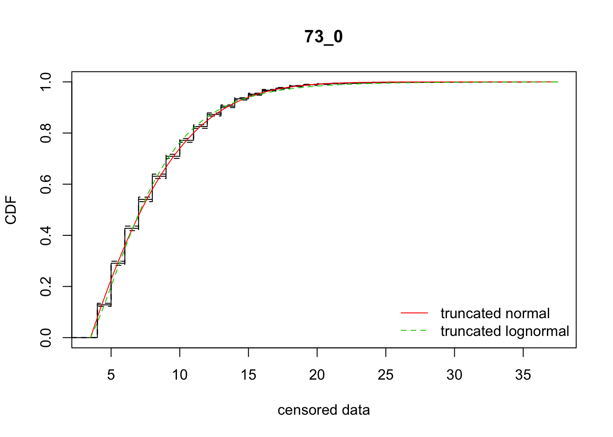
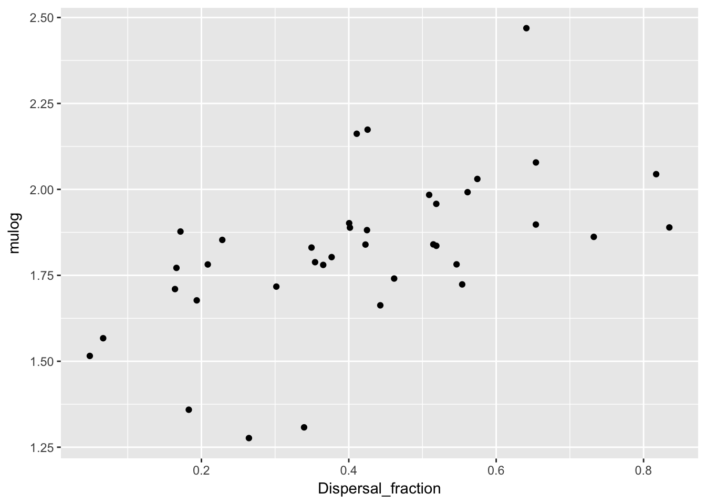
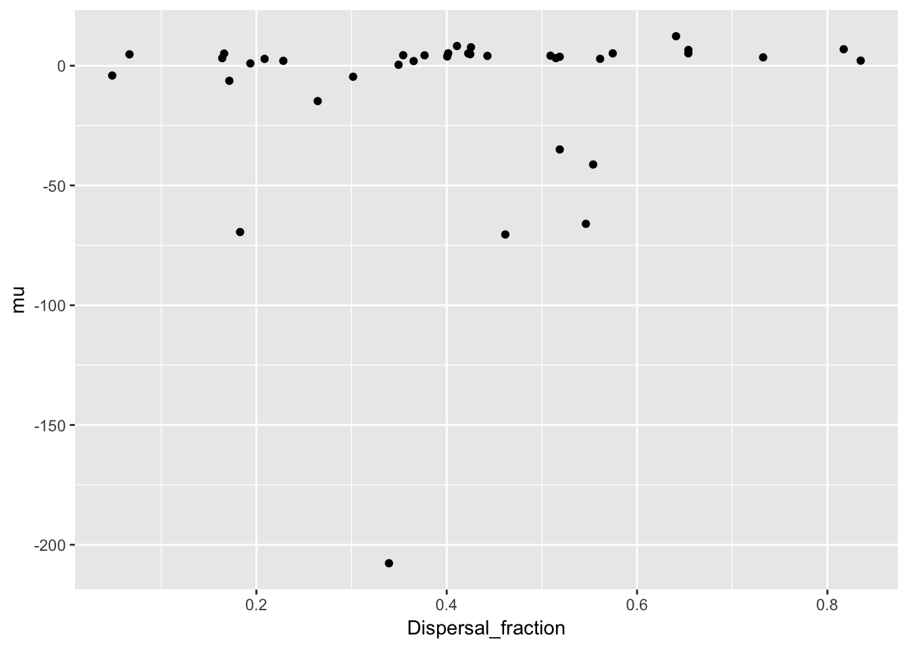
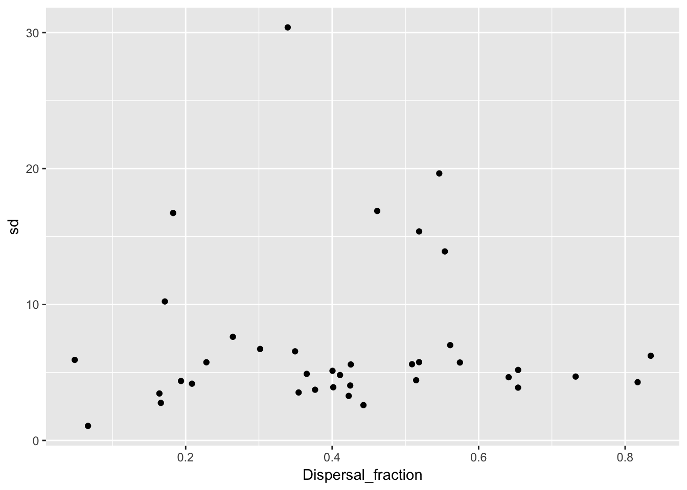
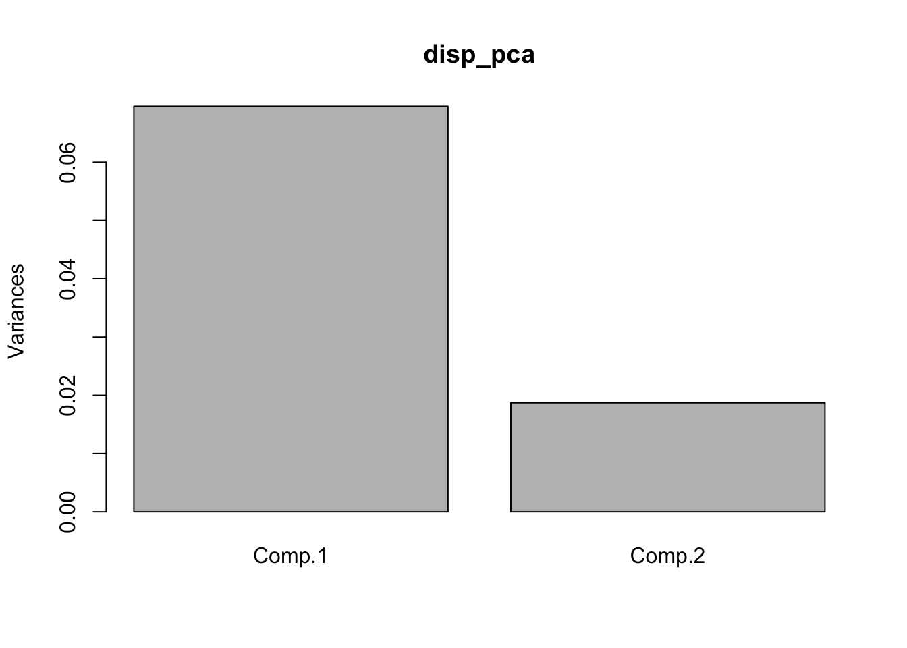
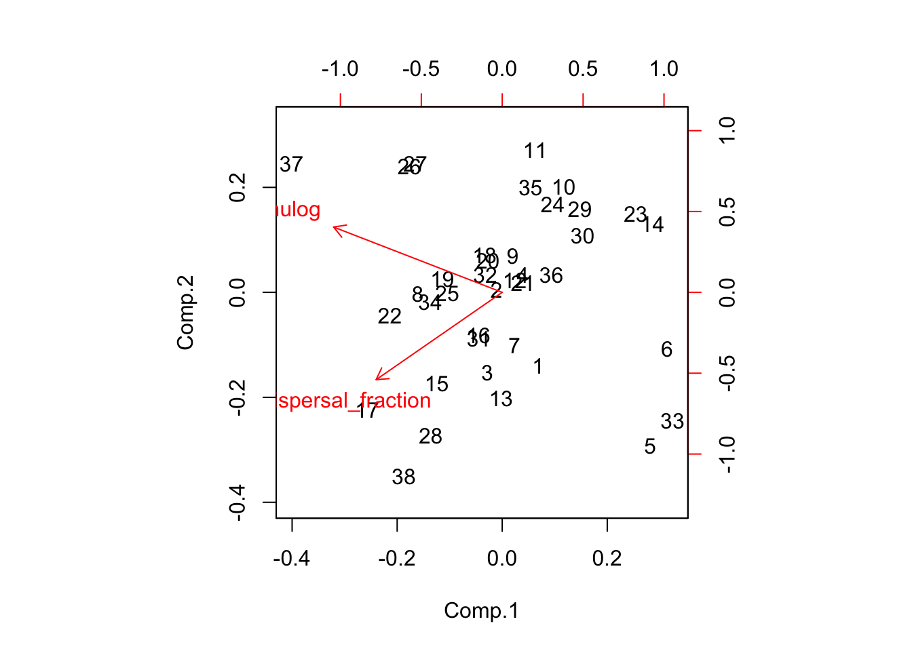
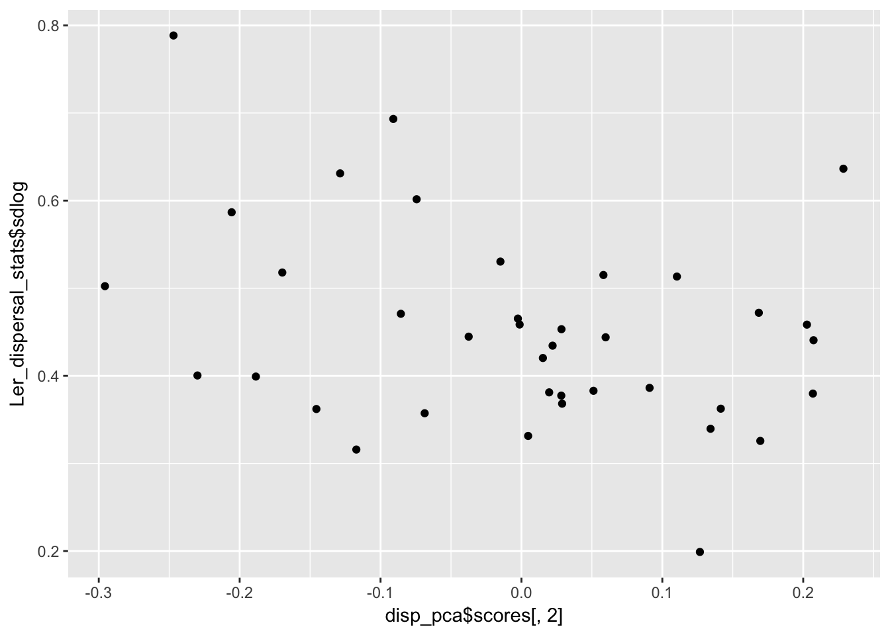

# 22 September 2017


```
Warning in .load.config(override.config): Your configuration file
is missing the following entries: data_loading_header, data_ignore,
logging_level, cache_loaded_data, sticky_variables. Defaults will be used.
```

```
Warning in .check.version(config): Your configuration is compatible with version 0.7 of the ProjectTemplate package.
  Please run ProjectTemplate::migrate.project() to migrate to the installed version 0.8.
```

The next steps in the Ler dispersal analysis are to confirm statistical support for among-rep heterogeneity and see if the kernel parameters are correlated with the fraction dispersing.

## Housekeeping
Added the functions for the truncated distributions and to fit the models to lib/helpers.R.

## Kernel heterogeneity
The total AIC for the rep-specific fits was 58230.28 and 58366.17 for the normal and lognormal models, respectively.

I *think* that if I pass the whole data set to the analysis function it will combine all the data. Let's look at this:

```r
sum(disperseLer$Seedlings[disperseLer$Distance > 4])
```

```
[1] 11928
```

```r
data_loc <- subset(disperseLer, Distance > 4)
data_vec <- rep(data_loc$Distance, data_loc$Seedlings)
length(data_vec)
```

```
[1] 11928
```
That's a match!


```r
fit_dispersal_models(disperseLer)
```



```
       ID  AICnorm AIClnorm         mu       sd    mulog   sdlog
mean 73_0 59772.17 59799.07 -0.7149118 7.407026 1.905282 0.50168
```

Ignore the ID on the graphical and text output.

What we see are good fits overall. Again, the normal is somewhat better than the lognormal ($\Delta_{\text{AIC}} =$ 26.9). But the rep-specific fits have AIC's that are more than 1400 AIC units lower!

## Correlations with fraction dispersing

Regenerate the datsets, without the plots (may want to put this into a munge script):

```r
all_Ler_fits <- ddply(disperseLer, "ID", fit_dispersal_models, plot.it = FALSE) 
```

```
Warning in sqrt(diag(varcovar)): NaNs produced
```

```
Warning in sqrt(1/diag(V)): NaNs produced
```

```
Warning in cov2cor(varcovar): diag(.) had 0 or NA entries; non-finite
result is doubtful
```

```r
Ler_dispersal_stats <- calc_dispersal_stats(disperseLer)
Ler_dispersal_stats <- merge(Ler_dispersal_stats, all_Ler_fits, by = "ID")
head(Ler_dispersal_stats)  
```

```
     ID Density Siliques Total_seeds Home_seeds Dispersing_seeds
1 100_0       1      126         131         73               58
2 101_0       1      177         336        194              142
3 104_0     390       NA        1384        628              756
4 105_0    1227       NA        1180        762              418
5 106_0     107       NA         389        257              132
6 107_0     199       NA         946        773              173
  Dispersal_fraction Mean_dispersal_all RMS_dispersal_all Mean_dispersal
1          0.4427481           2.580153          4.034205       5.827586
2          0.4226190           2.875000          4.663690       6.802817
3          0.5462428           4.593931          7.099011       8.410053
4          0.3542373           2.363559          4.197760       6.672249
5          0.3393316           2.611825          5.267156       7.696970
6          0.1828753           1.286469          3.335535       7.034682
  RMS_dispersal   AICnorm  AIClnorm          mu        sd    mulog
1      6.062889  210.1962  209.4645    4.098267  2.598637 1.662753
2      7.173896  602.7757  592.9470    5.101474  3.277311 1.839458
3      9.605168 3917.2841 3922.7279  -66.020580 19.643467 1.781924
4      7.052944 1749.4258 1745.8809    4.371632  3.528681 1.788268
5      9.041990  646.6945  643.1798 -207.715199 30.384323 1.307769
6      7.799881  785.4472  789.4764  -69.438135 16.731328 1.359045
      sdlog        se_mu       se_sd   se_mulog   se_sdlog
1 0.3158626  1.330679703 0.634838130 0.06392084 0.04807686
2 0.3314258  0.810572636 0.441435119 0.03321615 0.02656491
3 0.6310585          NaN         NaN 0.04842916 0.03103006
4 0.3682102  0.648281310 0.312409282 0.02473200 0.01922509
5 0.7884596  0.007112144 0.004535006 0.30807962 0.13543948
6 0.6932002 21.032531014 2.279795670 0.21971090 0.10060063
```

Now look at some plots

```r
qplot(Dispersal_fraction, mulog, data = Ler_dispersal_stats) 
```



```r
qplot(Dispersal_fraction, sdlog, data = Ler_dispersal_stats) 
```


```r
qplot(Dispersal_fraction, mu, data = Ler_dispersal_stats) 
```



```r
qplot(Dispersal_fraction, sd, data = Ler_dispersal_stats) 
```



There is a clear pattern with mulog, but nothing else. This is another reason to favor the lognormal distribution, as it indicates a mechanistic interconnection between the two components of the dispersal kernel. Here's the actual relationship:

```r
cor(Ler_dispersal_stats$mulog, Ler_dispersal_stats$Dispersal_fraction) 
```

```
[1] 0.5604027
```

```r
summary(lm(mulog ~ Dispersal_fraction, data = Ler_dispersal_stats))
```

```

Call:
lm(formula = mulog ~ Dispersal_fraction, data = Ler_dispersal_stats)

Residuals:
     Min       1Q   Median       3Q      Max 
-0.46413 -0.07753  0.00646  0.09439  0.49780 

Coefficients:
                   Estimate Std. Error t value Pr(>|t|)    
(Intercept)         1.54775    0.07454   20.76  < 2e-16 ***
Dispersal_fraction  0.66056    0.16271    4.06 0.000253 ***
---
Signif. codes:  0 '***' 0.001 '**' 0.01 '*' 0.05 '.' 0.1 ' ' 1

Residual standard error: 0.1928 on 36 degrees of freedom
Multiple R-squared:  0.3141,	Adjusted R-squared:  0.295 
F-statistic: 16.48 on 1 and 36 DF,  p-value: 0.0002531
```

## Implications for modeling
A simple-minded approach would be to draw a random dispersal fraction, and then use the regression (including the residuals) to get a value for mulog. But really, we should be doing draws from a multivariate distribution. The challenge, then, is taking into account the (presumably) beta distribution for the dispersal fraction. We can use Morris & Doak's approach of simulating multivariate normals and then matching quantiles to get the beta distribution; since the latter is pretty symmetric (looks like the mean is around 0.4) it should recover the correlation coefficient pretty closely.

A bigger conceptual issue is that the points in the scatterplots above are each measured with error, in both directions (binomial sampling for the dispersal fraction, MLE standard errors in mulog). This is another reason to avoid OLS regression; but does it introduce bias into the estimate of the correlation? There may be a solution to this at https://www.rasch.org/rmt/rmt101g.htm

Third, is sdlog independent of mulog (we have already seen that it's independent of dispersal fraction)? What about its relationship to the major and minor axes of the mulog-dispersal fraction distribution?

Finally, when we are working with the populations, do we assume that all pots in a replicate at a particular generation experience the same dispersal kernel? Or that *each pot* gets an independent sample of the kernel? If most of the spread is driven by seeds coming from the front pot, then it won't matter much.

## Disattenuated correlation coefficient
Actually, I've convinced myself that I don't need to do this. We will be using the covariance rather than the correlation, and some calculations reveal that the covariance is not biased by measurement error. The disattenuation calculation is to correct for the inflated variances caused by measurement error that are used in calculating the correlation from the covariance.

Of course, I *will* need to get those corrected variances for population the VC matrix to use in simulation. The way to do this is to subtract the mean squared standard error from the raw variance estimates.

I've modified the kernel fitting routine to return the standard errors of the parameter estimates. So now for the corrections:

```r
var(Ler_dispersal_stats$mulog)
```

```
[1] 0.05273925
```

```r
var(Ler_dispersal_stats$mulog) - mean((Ler_dispersal_stats$se_mulog)^2)
```

```
[1] 0.03825842
```

```r
Ler_dispersal_stats <- mutate(Ler_dispersal_stats,
                              binom_var = Dispersal_fraction * (1 - Dispersal_fraction) /
                                Total_seeds)
var(Ler_dispersal_stats$Dispersal_fraction)
```

```
[1] 0.03795841
```

```r
var(Ler_dispersal_stats$Dispersal_fraction) - mean(Ler_dispersal_stats$binom_var)
```

```
[1] 0.03740287
```
The first correction is substantial, the second one minor.

## Patterns of sdlog

```r
qplot(mulog, sdlog, data = Ler_dispersal_stats) 
```


```r
disp_pca <- princomp(~ mulog + Dispersal_fraction, data = Ler_dispersal_stats)
screeplot(disp_pca)
```



```r
biplot(disp_pca)
```



```r
qplot(disp_pca$scores[,1], Ler_dispersal_stats$sdlog)
```


```r
qplot(disp_pca$scores[,2], Ler_dispersal_stats$sdlog)
```



```r
summary(lm(Ler_dispersal_stats$sdlog ~ disp_pca$scores[,2]))
```

```

Call:
lm(formula = Ler_dispersal_stats$sdlog ~ disp_pca$scores[, 2])

Residuals:
     Min       1Q   Median       3Q      Max 
-0.21719 -0.07239 -0.01247  0.06634  0.26884 

Coefficients:
                     Estimate Std. Error t value Pr(>|t|)    
(Intercept)           0.45126    0.01783  25.309   <2e-16 ***
disp_pca$scores[, 2] -0.27682    0.13037  -2.123   0.0407 *  
---
Signif. codes:  0 '***' 0.001 '**' 0.01 '*' 0.05 '.' 0.1 ' ' 1

Residual standard error: 0.1099 on 36 degrees of freedom
Multiple R-squared:  0.1113,	Adjusted R-squared:  0.08661 
F-statistic: 4.508 on 1 and 36 DF,  p-value: 0.04067
```

```r
cov(subset(Ler_dispersal_stats, select = c(mulog, sdlog, Dispersal_fraction)))
```

```
                          mulog         sdlog Dispersal_fraction
mulog               0.052739247 -0.0086961783       0.0250738618
sdlog              -0.008696178  0.0132258602       0.0001367011
Dispersal_fraction  0.025073862  0.0001367011       0.0379584103
```

```r
cor(subset(Ler_dispersal_stats, select = c(mulog, sdlog, Dispersal_fraction)))
```

```
                        mulog        sdlog Dispersal_fraction
mulog               1.0000000 -0.329267986        0.560402749
sdlog              -0.3292680  1.000000000        0.006101068
Dispersal_fraction  0.5604027  0.006101068        1.000000000
```

It looks like there is heteroskedasity (sdlog is larger for high values of PC1, which is low values of mulog), and a weak negative association with PC2.
