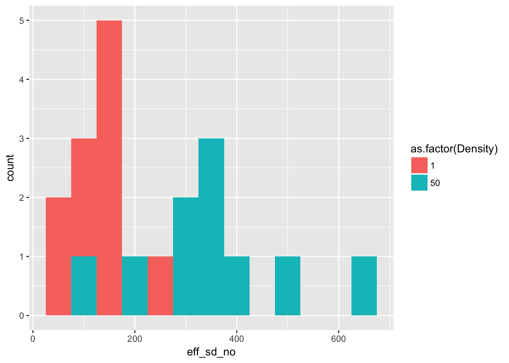
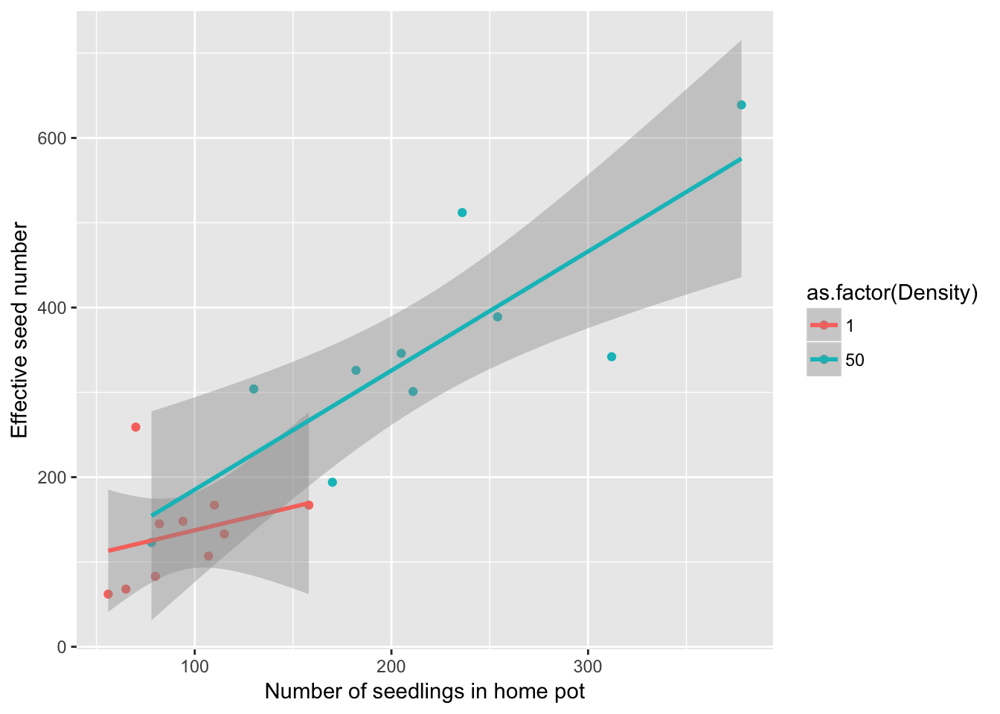
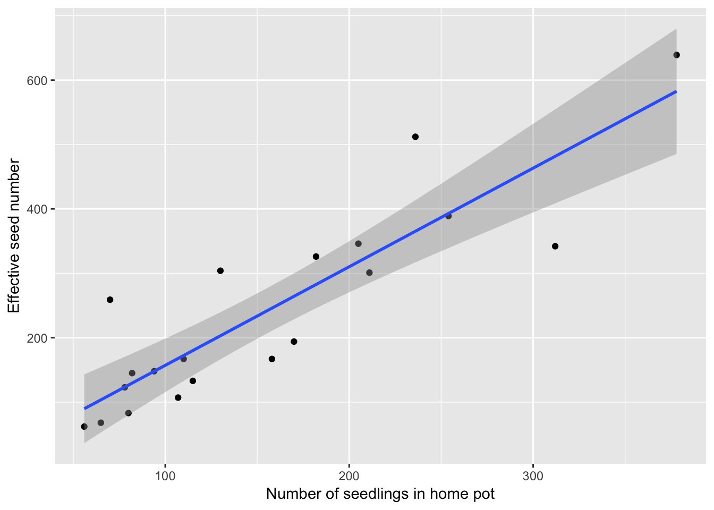

# 21 April 2017


## Data munging
Realizing that I need to re-use the `seedlings1` data from last time, I see that I should start to use the `munge` directory for key derived data. I therefore ned to give it a more meaningful name; how about `Ler_seeds_gen1`. I'll also add some more information about home and away

The code for doing this is in `munge/01-Ler-seed-gen1.R`

## Ler fecundity
### Reanalyze effective seed number

In the process of doing this I discovered that last time I failed to double the dispersing seeds in the effective seed number calculation. So let's redo the graph and table.

Plot the distributions:

```r
ggplot(Ler_seed_gen1, aes(x = eff_sd_no, fill = as.factor(Density))) + 
  geom_histogram(binwidth = 50)
```



(of course, stacked histograms aren't great, but it gives the general idea).

Now look at the mean and variance across pots:

```r
kable(group_by(Ler_seed_gen1, Density) %>% 
        summarise(Mean = mean(eff_sd_no), Variance = var(eff_sd_no)),
      caption = paste("Mean and variance across pots of effective seed number",
                      "in treatments B and C of Ler generation 1")
      )
```


Table: Mean and variance across pots of effective seed number in treatments B and C of Ler generation 1

 Density    Mean    Variance
--------  ------  ----------
       1   133.9    3443.433
      50   347.6   21362.933

This changes the quantitative mean:variance ratios:

- For isolated plants, the variance is about 26 times the mean. Compared with Poisson, this is huge!
- As we go from a density of 1 to 50, the seeds per plant drops by a factor of 19, from 134 to about 7.
- If the among-pot variance at high density was caused by iid variation in individual seed production, the among individual variance would need to be 21363/50, or about 427. 
    - This is a 2-fold increase in the variance:mean ratio
    - It seems that, to acheive this among-individual variance, almost all the seeds in the high density plots would need to come from one or two individuals--and whether the among-successful-individual variance required is consistent with what we see in isolated pots remains an open question. We would need to assume something like a lognormal distribution among individuals to get at this.

### Home seeds as proxy
Now lets look at how well home seeds predicts total effective seeds:

```r
qplot(home, eff_sd_no, data = Ler_seed_gen1, 
      group = as.factor(Density), colour = as.factor(Density),
      xlab = "Number of seedlings in home pot", 
      ylab = "Effective seed number"
      ) + 
  geom_smooth(method = "lm")
```



```r
summary(lm(eff_sd_no ~ home * as.factor(Density), data = Ler_seed_gen1))
```

```

Call:
lm(formula = eff_sd_no ~ home * as.factor(Density), data = Ler_seed_gen1)

Residuals:
    Min      1Q  Median      3Q     Max 
-140.99  -40.94   -7.44   24.48  138.17 

Coefficients:
                          Estimate Std. Error t value Pr(>|t|)
(Intercept)                82.2439    80.5487   1.021    0.322
home                        0.5513     0.8223   0.670    0.512
as.factor(Density)50      -37.4497   104.2092  -0.359    0.724
home:as.factor(Density)50   0.8532     0.8708   0.980    0.342

Residual standard error: 74.29 on 16 degrees of freedom
Multiple R-squared:  0.8045,	Adjusted R-squared:  0.7678 
F-statistic: 21.94 on 3 and 16 DF,  p-value: 6.482e-06
```

There's no evidence for differences among the two pots, so fortunately we can merge them:

```r
qplot(home, eff_sd_no, data = Ler_seed_gen1, 
      xlab = "Number of seedlings in home pot", 
      ylab = "Effective seed number"
      ) + 
  geom_smooth(method = "lm")
```



```r
summary(lm(eff_sd_no ~ home, data = Ler_seed_gen1))
```

```

Call:
lm(formula = eff_sd_no ~ home, data = Ler_seed_gen1)

Residuals:
     Min       1Q   Median       3Q      Max 
-139.659  -44.354   -4.624   31.966  147.853 

Coefficients:
            Estimate Std. Error t value Pr(>|t|)    
(Intercept)   3.9745    34.2927   0.116    0.909    
home          1.5310     0.1935   7.911 2.87e-07 ***
---
Signif. codes:  0 '***' 0.001 '**' 0.01 '*' 0.05 '.' 0.1 ' ' 1

Residual standard error: 74.86 on 18 degrees of freedom
Multiple R-squared:  0.7766,	Adjusted R-squared:  0.7642 
F-statistic: 62.58 on 1 and 18 DF,  p-value: 2.873e-07
```

Fortunately the relationship is linear and independent of density (although with only two density treatments these conclustions are not super robust). And while we explain 78% of the variance there is still some scatter: the home pot seeds represents "measurement error" relative to the effective seed number (although the effective seed number itself seems pretty stochastic, as the fraction of seeds dispersing is pretty stochastic). However, it's the best we have.
