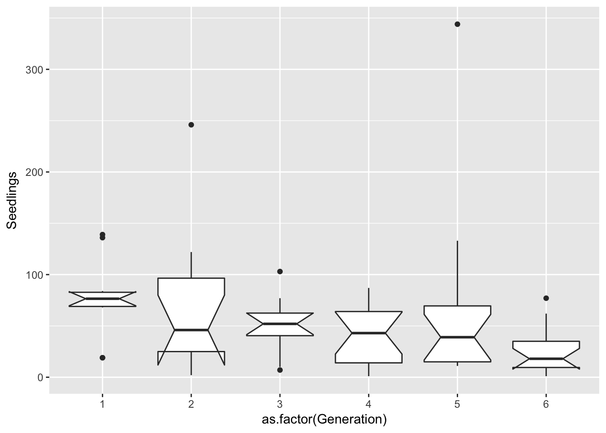
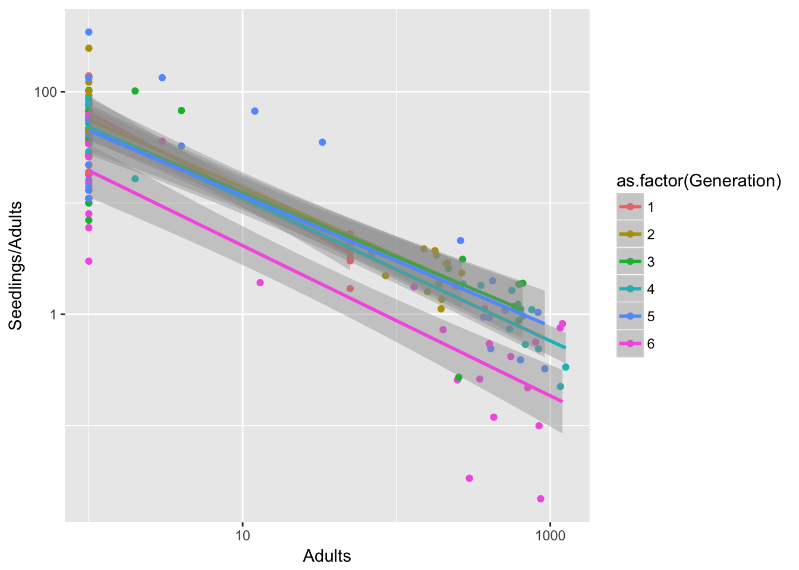
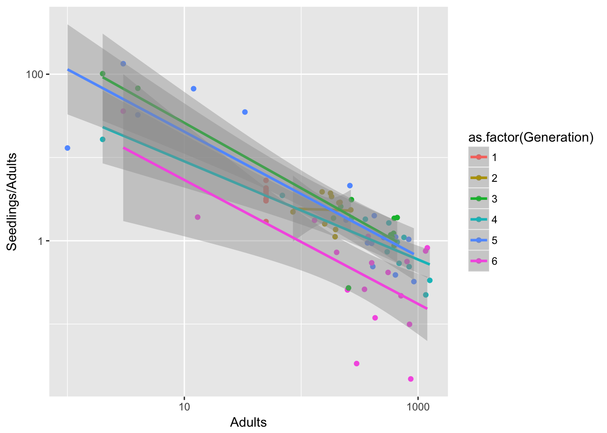

# 24 April 2017


## DD Ler fecundity
We use the 3-pot gaps, looking at seeds in the home pot. The rationale is that a trivial number of seeds will be arriving from other pots.


```r
Ler3pBC <- filter(popLer, Gap == "3p", Treatment != "A")
Ler3pBC <- group_by(Ler3pBC, Treatment, Pot, Rep) %>%
  mutate(Adults = lag(Seedlings)) 
Ler3pBC <- within(Ler3pBC,
                  {
                    Adults[Treatment == "B" & !is.na(Adults)] <- 1
                    Adults[Pot == 0 & Generation == 1] <- 1
                    Adults[Treatment == "C" & Pot == 0 & Generation == 1] <- 50
                  })
```

I couldn't figure out how to do it all in dplyr!

I think there's something wierd going on in generation 6, let's look at treatment B:


```r
filter(Ler3pBC, Treatment == "B") %>%
  ggplot(aes(x = as.factor(Generation), y = Seedlings)) + geom_boxplot(notch = TRUE) 
```

```
notch went outside hinges. Try setting notch=FALSE.
notch went outside hinges. Try setting notch=FALSE.
notch went outside hinges. Try setting notch=FALSE.
```



Actually, it's the first and last generations that are odd: Gen 1 is unusually productive, and Gen 6 is unusually underproductive.

Let's look at the density dependence:

```r
qplot(data=Ler3pBC, x = Adults, y = Seedlings/Adults, 
      colour = as.factor(Generation), log = "xy") + 
  geom_smooth(method = "lm")
```

```
Warning: Removed 15 rows containing non-finite values (stat_smooth).
```

```
Warning: Removed 15 rows containing missing values (geom_point).
```


Generation 6 looks really different.

It's a bit less pronounced if we leave out treatment B, but it's still there:

```r
qplot(data=filter(Ler3pBC, Treatment == "C"), x = Adults, y = Seedlings/Adults, 
      colour = as.factor(Generation), log = "xy") + 
  geom_smooth(method = "lm")
```

```
Warning: Removed 9 rows containing non-finite values (stat_smooth).
```

```
Warning: Removed 9 rows containing missing values (geom_point).
```



So I think we want to leave out gen 6. 

Note that there looks to be some curvature in the log-log plot, suggesting that the log tramsform of Adults is too strong. Need to estimate a power transform instead, or the Wilkinson model.
