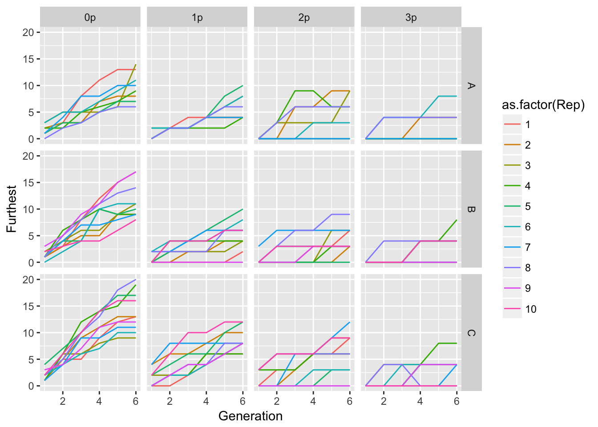
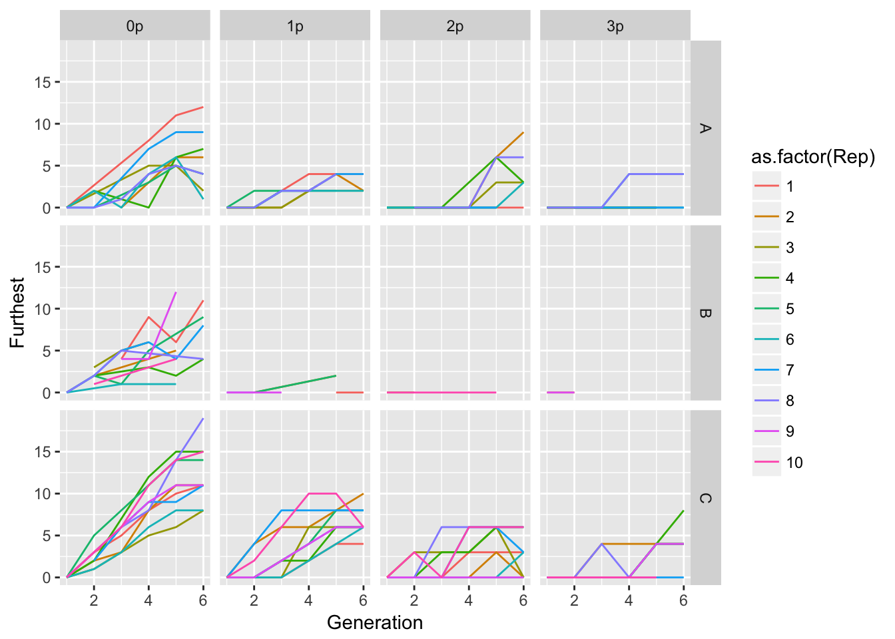

# 26 April 2017


## Calculate Ler spread rates
First we look at furthest distance reached.

```r
Ler_furthest <- group_by(popLer, Treatment, Gap, Rep, Generation) %>%
  summarise(Furthest = max(Pot))
ggplot(Ler_furthest, aes(x = Generation, y = Furthest, color = as.factor(Rep))) +
  geom_line() + facet_grid(Treatment ~ Gap)
```



Hmm, I've uncovered that popLer has a line of all NA's (and popLer_cm has three)! I've gone ahead and updated `popLer.R` (and added `plyr` to the set of autoloaded packages) to fix this. Now I don't have extra rows/columns in the facet table!

Now let's look at a threshold:

```r
threshold <- 100
Ler_thresh <- filter(popLer, Seedlings > threshold) %>%
  group_by(Treatment, Gap, Rep, Generation) %>%
  summarise(Furthest = max(Pot))
ggplot(Ler_thresh, aes(x = Generation, y = Furthest, color = as.factor(Rep))) +
  geom_line() + facet_grid(Treatment ~ Gap)
```



Not surprisingly, this works best for for Treatment C. 


```r
mean(filter(Ler_furthest, Treatment == "C", Gap == "0p", Generation == 6)$Furthest)
```

```
[1] 14
```

```r
var(filter(Ler_furthest, Treatment == "C", Gap == "0p", Generation == 6)$Furthest)
```

```
[1] 14.44444
```

```r
mean(filter(Ler_thresh, Treatment == "C", Gap == "0p", Generation == 6)$Furthest)
```

```
[1] 12.3
```

```r
var(filter(Ler_thresh, Treatment == "C", Gap == "0p", Generation == 6)$Furthest)
```

```
[1] 11.78889
```

The mean and variance of total distance travelled is slightly less in the threshold case, but that might all be attributed to generation 1 (effectively, there is a one-generation delay between inititial colonization and reaching the threshold, here set to 100 seetlings).

HMMPF Now I'm getting an error from load.project() that seems to derive from the 01-Ler-seed-gen1.R --- except that the script works fine when I run it in the console!

4/28: Solved this---it had to do with loading both plyr and dplyr in the initialization file. I've taken out plyr, and explicitly used `plyr::ddply()` in the script that generates popLer.
