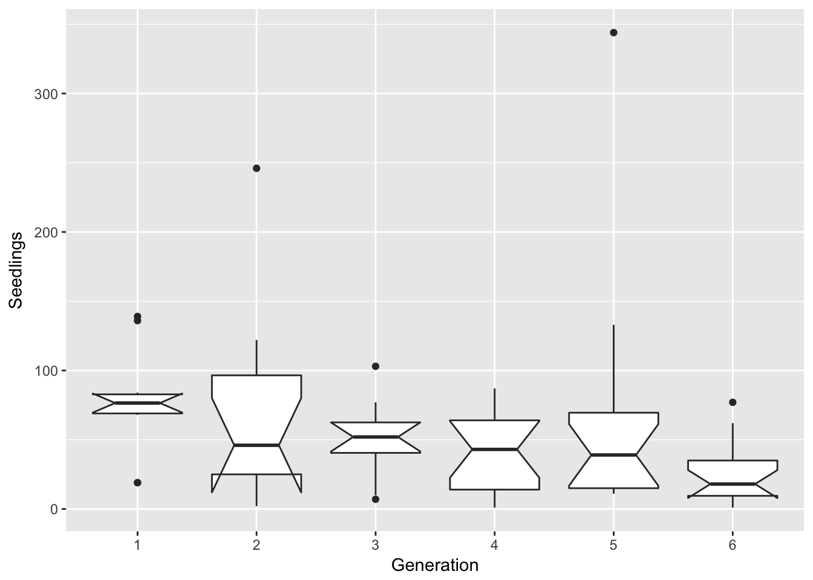
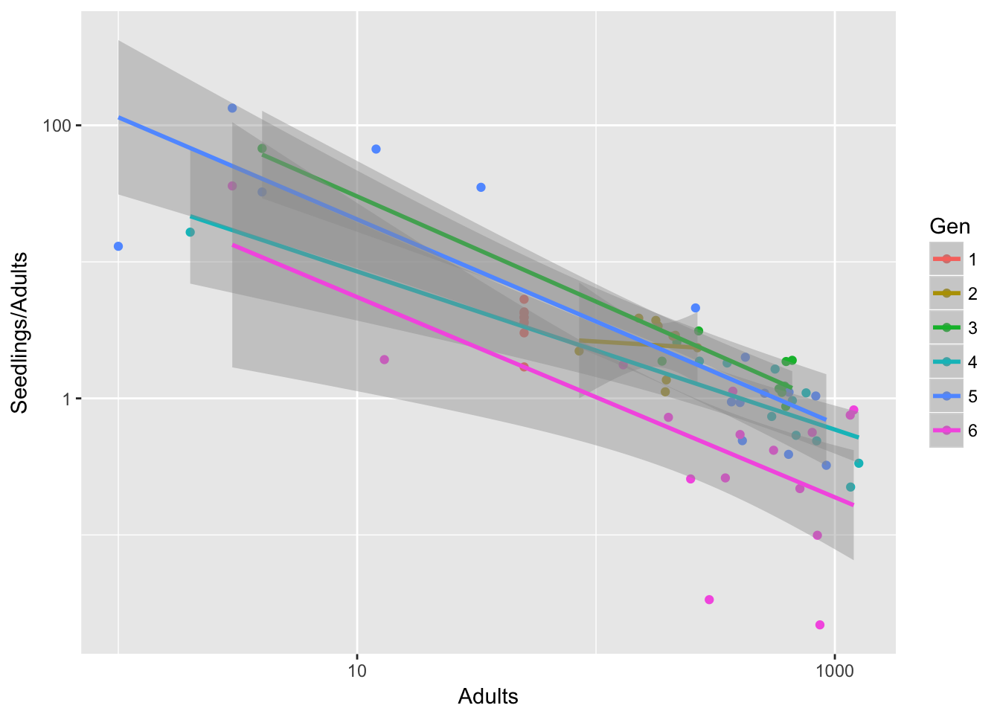

# 19 May 2027


## Evolution data: Gen 7 = no

Jenn has this to say about generation 7 of the evolution experiment (email of 19 May):

> Gen7 was the mystery one... it had tons of contaminants in the genetic data, seedlings went weird distances (strangely far and/or not at all), and that’s when Sara was really having a ton of trouble. We didn’t include Gen7 in the Science paper because of all these potential challenges with it (although did analyze it to make sure the results didn’t all just go away!). So I think also better to leave it out of your analyses.

## Reboot Ler fecundity
Need to check if the data have changed!

### Generation 1 fecundity
(Update of original analysis of 21 April 2017)


```r
ggplot(Ler_seed_gen1, aes(x = eff_sd_no, fill = as.factor(Density))) + 
  geom_histogram(binwidth = 50)
```


```r
kable(group_by(Ler_seed_gen1, Density) %>% 
        summarise(Mean = mean(eff_sd_no), Variance = var(eff_sd_no)),
      caption = paste("Mean and variance across pots of effective seed number",
                      "in treatments B and C of Ler generation 1")
      )
```


Table: Mean and variance across pots of effective seed number in treatments B and C of Ler generation 1

 Density    Mean    Variance
--------  ------  ----------
       1   133.9    3443.433
      50   347.6   21362.933

This is identical to the original analysis.

### Time variation in fecundity
This is the part of the 24 April analysis that looked at treatment B:

```r
Ler3pBC <- filter(popLer, Gap == "3p", Treatment != "A")
Ler3pBC <- group_by(Ler3pBC, Treatment, Pot, Rep) %>%
  mutate(Adults = lag(Seedlings)) 
Ler3pBC <- within(Ler3pBC,
                  {
                    Adults[Treatment == "B" & !is.na(Adults)] <- 1
                    Adults[Pot == 0 & Generation == 1] <- 1
                    Adults[Treatment == "C" & Pot == 0 & Generation == 1] <- 50
                  })
```

```r
filter(Ler3pBC, Treatment == "B") %>%
  ggplot(aes(x = Gen, y = Seedlings)) + xlab("Generation") + geom_boxplot(notch = TRUE) 
```

```
notch went outside hinges. Try setting notch=FALSE.
notch went outside hinges. Try setting notch=FALSE.
notch went outside hinges. Try setting notch=FALSE.
```



By eye, this looks unchanged. Let's try a log scale:

```r
filter(Ler3pBC, Treatment == "B") %>%
  ggplot(aes(x = Gen, y = Seedlings)) + xlab("Generation") + geom_boxplot(notch = TRUE) +
  scale_y_log10()
```

```
notch went outside hinges. Try setting notch=FALSE.
notch went outside hinges. Try setting notch=FALSE.
notch went outside hinges. Try setting notch=FALSE.
notch went outside hinges. Try setting notch=FALSE.
notch went outside hinges. Try setting notch=FALSE.
```


That looks to mostly skew things in the other direction. Perhaps a square root transform?

```r
filter(Ler3pBC, Treatment == "B") %>%
  ggplot(aes(x = Gen, y = Seedlings)) + xlab("Generation") + geom_boxplot(notch = TRUE) +
  scale_y_sqrt()
```

```
notch went outside hinges. Try setting notch=FALSE.
notch went outside hinges. Try setting notch=FALSE.
notch went outside hinges. Try setting notch=FALSE.
notch went outside hinges. Try setting notch=FALSE.
```


That's nice. Now let's do a linear model:

```r
summary(lm(sqrt(Seedlings) ~ Gen, data = filter(Ler3pBC, Treatment == "B")))
```

```

Call:
lm(formula = sqrt(Seedlings) ~ Gen, data = filter(Ler3pBC, Treatment == 
    "B"))

Residuals:
    Min      1Q  Median      3Q     Max 
-6.1230 -2.2023 -0.0066  1.8917 11.5703 

Coefficients:
            Estimate Std. Error t value Pr(>|t|)    
(Intercept)   8.4447     0.9746   8.665  8.8e-13 ***
Gen2         -0.9075     1.3466  -0.674  0.50251    
Gen3         -1.6444     1.3466  -1.221  0.22601    
Gen4         -2.8167     1.2582  -2.239  0.02827 *  
Gen5         -1.4678     1.2582  -1.167  0.24724    
Gen6         -3.9232     1.2424  -3.158  0.00232 ** 
---
Signif. codes:  0 '***' 0.001 '**' 0.01 '*' 0.05 '.' 0.1 ' ' 1

Residual standard error: 3.082 on 72 degrees of freedom
Multiple R-squared:  0.1576,	Adjusted R-squared:  0.0991 
F-statistic: 2.694 on 5 and 72 DF,  p-value: 0.02744
```

It actually looks like it might be linear!

```r
summary(lm(sqrt(Seedlings) ~ Generation, data = filter(Ler3pBC, Treatment == "B")))
```

```

Call:
lm(formula = sqrt(Seedlings) ~ Generation, data = filter(Ler3pBC, 
    Treatment == "B"))

Residuals:
    Min      1Q  Median      3Q     Max 
-6.1911 -1.9276  0.1918  1.5063 12.8627 

Coefficients:
            Estimate Std. Error t value Pr(>|t|)    
(Intercept)   8.8859     0.8608  10.323 4.08e-16 ***
Generation   -0.6403     0.2074  -3.088  0.00282 ** 
---
Signif. codes:  0 '***' 0.001 '**' 0.01 '*' 0.05 '.' 0.1 ' ' 1

Residual standard error: 3.081 on 76 degrees of freedom
Multiple R-squared:  0.1115,	Adjusted R-squared:  0.09977 
F-statistic: 9.533 on 1 and 76 DF,  p-value: 0.002816
```

This definitely seems like a more parsimonious model. However, it's not clear how we should interpret it! Certainly it doesn't accord with fluctuating effects of season or insect outbreaks. It could be that the team got better at inducing dispersal... one thing to look at would be to see whether there is a similar trend in the other landscapes, or a trend in the number of seeds jumping the gap.

OK, back to the reboot:

### Density dependent fecundity
(also based on April 24)

```r
qplot(data=Ler3pBC, x = Adults, y = Seedlings/Adults, 
      colour = Gen, log = "xy") + 
  geom_smooth(method = "lm")
```

```
Warning: Removed 14 rows containing non-finite values (stat_smooth).
```

```
Warning: Removed 14 rows containing missing values (geom_point).
```


Generation 6 looks really different.

It's a bit less pronounced if we leave out treatment B, but it's still there:

```r
qplot(data=filter(Ler3pBC, Treatment == "C"), x = Adults, y = Seedlings/Adults, 
      colour = Gen, log = "xy") + 
  geom_smooth(method = "lm")
```

```
Warning: Removed 8 rows containing non-finite values (stat_smooth).
```

```
Warning: Removed 8 rows containing missing values (geom_point).
```



Is it just Gen 6, or is there still a linear trend in the intercept?

```r
m1 <- lm(log(Seedlings/Adults) ~ Adults + Gen, data = Ler3pBC)
m2 <- lm(log(Seedlings/Adults) ~ Adults + Generation, data = Ler3pBC)
AIC(m1)
```

```
[1] 474.2151
```

```r
AIC(m2)
```

```
[1] 481.8171
```

```r
summary(m1)
```

```

Call:
lm(formula = log(Seedlings/Adults) ~ Adults + Gen, data = Ler3pBC)

Residuals:
    Min      1Q  Median      3Q     Max 
-4.2616 -0.8728  0.0230  0.8158  3.6531 

Coefficients:
              Estimate Std. Error t value Pr(>|t|)    
(Intercept)  2.9266472  0.2859379  10.235   <2e-16 ***
Adults      -0.0052269  0.0003613 -14.468   <2e-16 ***
Gen2         0.0893939  0.4048630   0.221   0.8256    
Gen3         0.5141724  0.4000966   1.285   0.2010    
Gen4         0.7346576  0.4048698   1.815   0.0718 .  
Gen5         0.4482726  0.3697123   1.212   0.2274    
Gen6        -0.5019487  0.3731412  -1.345   0.1808    
---
Signif. codes:  0 '***' 0.001 '**' 0.01 '*' 0.05 '.' 0.1 ' ' 1

Residual standard error: 1.246 on 135 degrees of freedom
  (14 observations deleted due to missingness)
Multiple R-squared:  0.6429,	Adjusted R-squared:  0.627 
F-statistic: 40.51 on 6 and 135 DF,  p-value: < 2.2e-16
```

```r
anova(m1)
```

```
Analysis of Variance Table

Response: log(Seedlings/Adults)
           Df Sum Sq Mean Sq  F value    Pr(>F)    
Adults      1 350.80  350.80 226.0342 < 2.2e-16 ***
Gen         5  26.39    5.28   3.4013  0.006314 ** 
Residuals 135 209.52    1.55                       
---
Signif. codes:  0 '***' 0.001 '**' 0.01 '*' 0.05 '.' 0.1 ' ' 1
```

```r
summary(m2)
```

```

Call:
lm(formula = log(Seedlings/Adults) ~ Adults + Generation, data = Ler3pBC)

Residuals:
    Min      1Q  Median      3Q     Max 
-4.8110 -0.9846  0.1907  0.9253  2.9576 

Coefficients:
              Estimate Std. Error t value Pr(>|t|)    
(Intercept)  3.3590649  0.2666127  12.599   <2e-16 ***
Adults      -0.0050648  0.0003674 -13.785   <2e-16 ***
Generation  -0.0722116  0.0652395  -1.107     0.27    
---
Signif. codes:  0 '***' 0.001 '**' 0.01 '*' 0.05 '.' 0.1 ' ' 1

Residual standard error: 1.297 on 139 degrees of freedom
  (14 observations deleted due to missingness)
Multiple R-squared:  0.6014,	Adjusted R-squared:  0.5957 
F-statistic: 104.9 on 2 and 139 DF,  p-value: < 2.2e-16
```

Here, if anything, it looks quadratic:

```r
m3 <- lm(log(Seedlings/Adults) ~ Adults + poly(Generation,2), data = Ler3pBC)
AIC(m3)
```

```
[1] 471.2079
```

```r
anova(m3)
```

```
Analysis of Variance Table

Response: log(Seedlings/Adults)
                     Df Sum Sq Mean Sq  F value    Pr(>F)    
Adults                1 350.80  350.80 226.2383 < 2.2e-16 ***
poly(Generation, 2)   2  21.93   10.97   7.0719  0.001192 ** 
Residuals           138 213.98    1.55                       
---
Signif. codes:  0 '***' 0.001 '**' 0.01 '*' 0.05 '.' 0.1 ' ' 1
```

```r
summary(m3)
```

```

Call:
lm(formula = log(Seedlings/Adults) ~ Adults + poly(Generation, 
    2), data = Ler3pBC)

Residuals:
    Min      1Q  Median      3Q     Max 
-4.3838 -1.0034  0.0389  0.7699  3.5375 

Coefficients:
                       Estimate Std. Error t value Pr(>|t|)    
(Intercept)           3.1352719  0.1256288  24.957  < 2e-16 ***
Adults               -0.0052341  0.0003559 -14.708  < 2e-16 ***
poly(Generation, 2)1 -1.4438975  1.3083800  -1.104 0.271698    
poly(Generation, 2)2 -4.7130036  1.3165803  -3.580 0.000475 ***
---
Signif. codes:  0 '***' 0.001 '**' 0.01 '*' 0.05 '.' 0.1 ' ' 1

Residual standard error: 1.245 on 138 degrees of freedom
  (14 observations deleted due to missingness)
Multiple R-squared:  0.6353,	Adjusted R-squared:  0.6274 
F-statistic: 80.13 on 3 and 138 DF,  p-value: < 2.2e-16
```

Maybe. We can also try dropping Gen 6:

```r
m4 <- lm(log(Seedlings/Adults) ~ Adults + Gen, data = filter(Ler3pBC, Generation < 6))
m5 <- lm(log(Seedlings/Adults) ~ Adults + poly(Generation, 2), 
         data = filter(Ler3pBC, Generation < 6))
AIC(m4)
```

```
[1] 342.6575
```

```r
AIC(m5)
```

```
[1] 340.3917
```

```r
summary(m4)
```

```

Call:
lm(formula = log(Seedlings/Adults) ~ Adults + Gen, data = filter(Ler3pBC, 
    Generation < 6))

Residuals:
     Min       1Q   Median       3Q      Max 
-2.12284 -0.85786  0.03988  0.68163  2.45417 

Coefficients:
              Estimate Std. Error t value Pr(>|t|)    
(Intercept)  2.9377619  0.2510228  11.703   <2e-16 ***
Adults      -0.0056859  0.0003939 -14.435   <2e-16 ***
Gen2         0.1190896  0.3556574   0.335   0.7384    
Gen3         0.5993128  0.3538179   1.694   0.0933 .  
Gen4         0.8720573  0.3621620   2.408   0.0178 *  
Gen5         0.5209411  0.3265875   1.595   0.1137    
---
Signif. codes:  0 '***' 0.001 '**' 0.01 '*' 0.05 '.' 0.1 ' ' 1

Residual standard error: 1.093 on 105 degrees of freedom
  (12 observations deleted due to missingness)
Multiple R-squared:  0.6716,	Adjusted R-squared:  0.656 
F-statistic: 42.95 on 5 and 105 DF,  p-value: < 2.2e-16
```

```r
anova(m4)
```

```
Analysis of Variance Table

Response: log(Seedlings/Adults)
           Df  Sum Sq Mean Sq  F value Pr(>F)    
Adults      1 247.509 247.509 207.0324 <2e-16 ***
Gen         4   9.201   2.300   1.9241 0.1118    
Residuals 105 125.528   1.196                    
---
Signif. codes:  0 '***' 0.001 '**' 0.01 '*' 0.05 '.' 0.1 ' ' 1
```

```r
summary(m5)
```

```

Call:
lm(formula = log(Seedlings/Adults) ~ Adults + poly(Generation, 
    2), data = filter(Ler3pBC, Generation < 6))

Residuals:
     Min       1Q   Median       3Q      Max 
-2.05718 -0.94013  0.09753  0.73707  2.36654 

Coefficients:
                       Estimate Std. Error t value Pr(>|t|)    
(Intercept)           3.3867835  0.1246611  27.168   <2e-16 ***
Adults               -0.0056051  0.0003878 -14.453   <2e-16 ***
poly(Generation, 2)1  2.4370676  1.1543458   2.111   0.0371 *  
poly(Generation, 2)2 -1.5904080  1.1492391  -1.384   0.1693    
---
Signif. codes:  0 '***' 0.001 '**' 0.01 '*' 0.05 '.' 0.1 ' ' 1

Residual standard error: 1.092 on 107 degrees of freedom
  (12 observations deleted due to missingness)
Multiple R-squared:  0.6664,	Adjusted R-squared:  0.6571 
F-statistic: 71.26 on 3 and 107 DF,  p-value: < 2.2e-16
```

```r
anova(m5)
```

```
Analysis of Variance Table

Response: log(Seedlings/Adults)
                     Df  Sum Sq Mean Sq  F value  Pr(>F)    
Adults                1 247.509 247.509 207.7053 < 2e-16 ***
poly(Generation, 2)   2   7.224   3.612   3.0313 0.05241 .  
Residuals           107 127.505   1.192                     
---
Signif. codes:  0 '***' 0.001 '**' 0.01 '*' 0.05 '.' 0.1 ' ' 1
```
Yeah, that pretty much eliminates it all.
