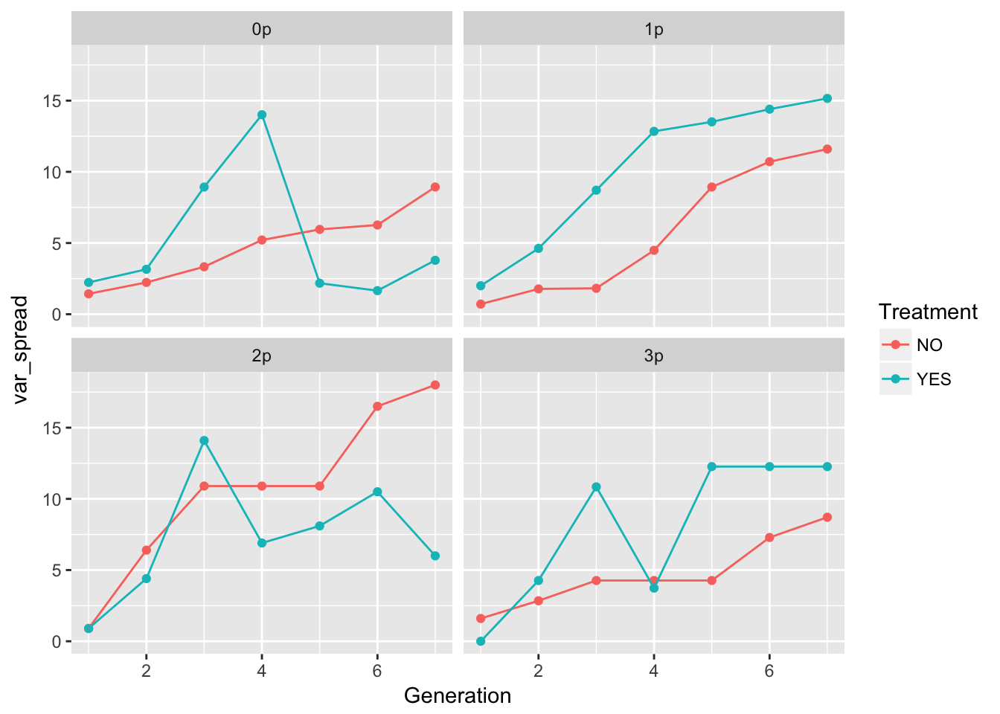
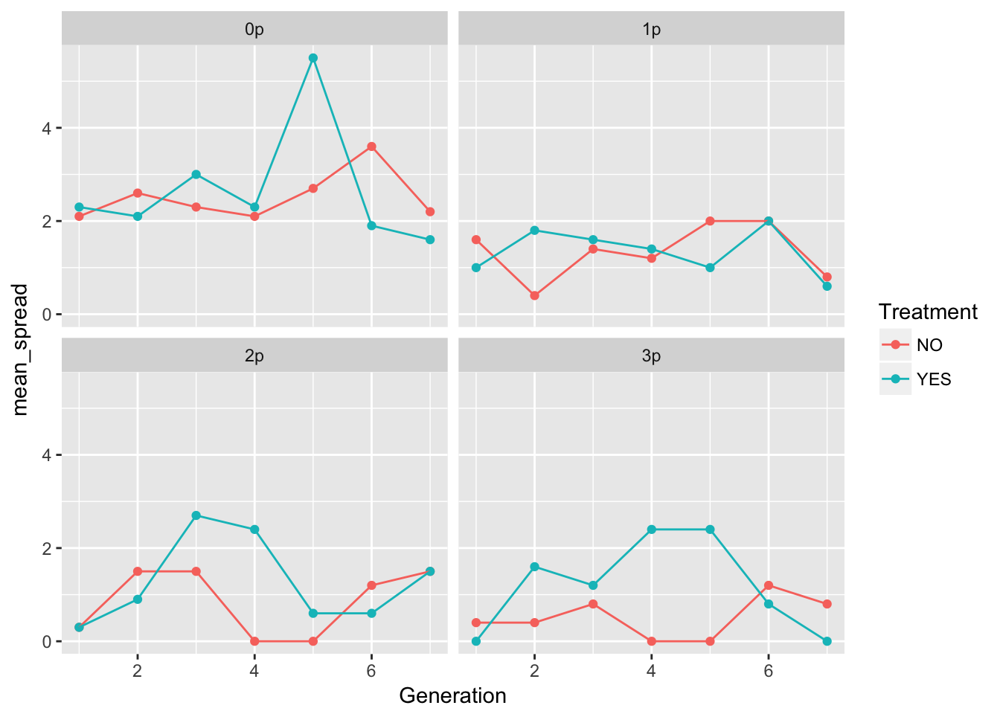

# 10 May 2027


## Spread patterns in evolution experiments
We'll repeat the analysis with the newly loaded RIL data.
Let's calculate the means and variances of cumulative spread:

```r
cum_spread_stats <- group_by(RIL_spread, Treatment, Gap, Gen, Generation) %>%
  summarise(mean_spread = mean(Furthest),
            var_spread = var(Furthest),
            CV_spread = sqrt(var_spread)/mean_spread
  )
```

And now plot the results:

```r
ggplot(aes(x = Generation, y = mean_spread, color = Treatment), data = cum_spread_stats) +
  geom_point() + geom_line() + facet_wrap(~ Gap)
```


```r
ggplot(aes(x = Generation, y = var_spread, color = Treatment), data = cum_spread_stats) +
  geom_point() + geom_line() + facet_wrap(~ Gap)
```



```r
ggplot(aes(x = Generation, y = CV_spread, color = Treatment), data = cum_spread_stats) +
  geom_point() + geom_line() + facet_wrap(~ Gap)
```

```
Warning: Removed 1 rows containing missing values (geom_point).
```


The patterns in the mean are probably not overly distinguishable from linear, although I'd want to see CIs.

Let's look at per-generation spread.


```r
speed_stats <- group_by(RIL_spread, Treatment, Gap, Gen, Generation) %>%
  summarise(mean_spread = mean(speed),
            var_spread = var(speed),
            CV_spread = sqrt(var_spread)/mean_spread
  )
```

And now plot the results:

```r
ggplot(aes(x = Generation, y = mean_spread, color = Treatment), data = speed_stats) +
  geom_point() + geom_line() + facet_wrap(~ Gap)
```



```r
ggplot(aes(x = Generation, y = var_spread, color = Treatment), data = speed_stats) +
  geom_point() + geom_line() + facet_wrap(~ Gap)
```


```r
ggplot(aes(x = Generation, y = CV_spread, color = Treatment), data = speed_stats) +
  geom_point() + geom_line() + facet_wrap(~ Gap)
```

```
Warning: Removed 6 rows containing missing values (geom_point).
```

```
Warning: Removed 1 rows containing missing values (geom_path).
```


In 0p and 1p, the treatments look very similar. But I bet there will be differences in the autocorrelation structure. Let's fit some models.


```r
m1_0NO <- lm(speed ~ Gen + Rep + speed_m1, data = filter(RIL_spread, Gap == "0p", Treatment == "NO"))
summary(m1_0NO)
```

```

Call:
lm(formula = speed ~ Gen + Rep + speed_m1, data = filter(RIL_spread, 
    Gap == "0p", Treatment == "NO"))

Residuals:
    Min      1Q  Median      3Q     Max 
-2.3398 -0.9501  0.0388  0.7904  3.5296 

Coefficients:
            Estimate Std. Error t value Pr(>|t|)   
(Intercept)   2.3567     0.7471   3.154   0.0029 **
Gen3         -0.2490     0.6206  -0.401   0.6902   
Gen4         -0.4796     0.6155  -0.779   0.4401   
Gen5          0.1000     0.6146   0.163   0.8715   
Gen6          1.0612     0.6232   1.703   0.0957 . 
Gen7         -0.2470     0.6669  -0.370   0.7129   
Rep2         -0.2007     0.7955  -0.252   0.8020   
Rep3          0.2347     0.8017   0.293   0.7711   
Rep4          0.6667     0.7934   0.840   0.4053   
Rep5          1.4013     0.8017   1.748   0.0874 . 
Rep6         -0.4660     0.7955  -0.586   0.5610   
Rep7          0.2007     0.7955   0.252   0.8020   
Rep8          0.7177     0.7981   0.899   0.3734   
Rep9          0.9353     0.8119   1.152   0.2556   
Rep10         1.0850     0.8063   1.346   0.1853   
speed_m1     -0.1020     0.1726  -0.591   0.5575   
---
Signif. codes:  0 '***' 0.001 '**' 0.01 '*' 0.05 '.' 0.1 ' ' 1

Residual standard error: 1.374 on 44 degrees of freedom
  (10 observations deleted due to missingness)
Multiple R-squared:  0.2873,	Adjusted R-squared:  0.04432 
F-statistic: 1.182 on 15 and 44 DF,  p-value: 0.3201
```

```r
car::Anova(m1_0NO)
```

```
Anova Table (Type II tests)

Response: speed
          Sum Sq Df F value Pr(>F)
Gen       14.832  5  1.5709 0.1882
Rep       18.390  9  1.0820 0.3949
speed_m1   0.660  1  0.3493 0.5575
Residuals 83.090 44               
```

```r
m1_0YES <- lm(speed ~ Gen + Rep + speed_m1, data = filter(RIL_spread, Gap == "0p", Treatment == "YES"))
summary(m1_0YES)
```

```

Call:
lm(formula = speed ~ Gen + Rep + speed_m1, data = filter(RIL_spread, 
    Gap == "0p", Treatment == "YES"))

Residuals:
    Min      1Q  Median      3Q     Max 
-4.4242 -0.9333 -0.0096  0.7844  9.4123 

Coefficients:
            Estimate Std. Error t value Pr(>|t|)   
(Intercept)   3.1877     1.2650   2.520   0.0154 * 
Gen3          0.8602     1.0866   0.792   0.4328   
Gen4          0.3393     1.0909   0.311   0.7572   
Gen5          3.4000     1.0862   3.130   0.0031 **
Gen6          0.4369     1.1807   0.370   0.7131   
Gen7         -0.5796     1.0877  -0.533   0.5968   
Rep2         -1.2330     1.4031  -0.879   0.3843   
Rep3         -0.7330     1.4031  -0.522   0.6040   
Rep4         -0.9329     1.4041  -0.664   0.5099   
Rep5         -0.6667     1.4023  -0.475   0.6368   
Rep6         -0.1667     1.4023  -0.119   0.9059   
Rep7         -0.5663     1.4031  -0.404   0.6884   
Rep8         -1.1998     1.4025  -0.856   0.3969   
Rep9         -0.4668     1.4025  -0.333   0.7408   
Rep10        -0.3333     1.4023  -0.238   0.8132   
speed_m1     -0.1990     0.1446  -1.376   0.1757   
---
Signif. codes:  0 '***' 0.001 '**' 0.01 '*' 0.05 '.' 0.1 ' ' 1

Residual standard error: 2.429 on 44 degrees of freedom
  (10 observations deleted due to missingness)
Multiple R-squared:   0.32,	Adjusted R-squared:  0.08825 
F-statistic: 1.381 on 15 and 44 DF,  p-value: 0.1992
```

```r
car::Anova(m1_0YES)
```

```
Anova Table (Type II tests)

Response: speed
           Sum Sq Df F value  Pr(>F)  
Gen        96.161  5  3.2602 0.01369 *
Rep         9.104  9  0.1715 0.99602  
speed_m1   11.173  1  1.8940 0.17572  
Residuals 259.560 44                  
---
Signif. codes:  0 '***' 0.001 '**' 0.01 '*' 0.05 '.' 0.1 ' ' 1
```

Nothing here, really, except for a generation effect in the evolution treatment, which is in turn driven by the high mean in generation 5. We don't have enough df to look at an interaction, let's look at the distribution of values to see if it's a single outlier:

```r
filter(RIL_spread, Treatment == "YES", Gap == "0p", Generation == 5)$speed
```

```
 [1] 16  3  7  6  5  7  1  4  3  3
```
It's rep 1 with a crazy jump. Could that be a data error? Let's look at the time series:

```r
filter(RIL_spread, Treatment == "YES", Gap == "0p", Rep == "1")$speed
```

```
[1]  2 -1  0  0 16  1  4
```

```r
popRIL %>% filter(Treatment == "YES", Gap == "0p", Rep == "1") %>%
  select(Generation, Pot, Seedlings) %>%
  reshape(timevar = "Generation", direction = "wide", idvar = "Pot")
```

```
   Pot Seedlings.1 Seedlings.2 Seedlings.3 Seedlings.4 Seedlings.5
1    0         262         503         602         785         506
2    1          47         330         484         454         172
3    2           5          NA          NA          NA         298
13   3          NA          NA          NA          NA         236
14   4          NA          NA          NA          NA         176
15   5          NA          NA          NA          NA         519
16   6          NA          NA          NA          NA         235
17   7          NA          NA          NA          NA         340
18   8          NA          NA          NA          NA         322
19   9          NA          NA          NA          NA         346
20  10          NA          NA          NA          NA         346
21  11          NA          NA          NA          NA         340
22  12          NA          NA          NA          NA         345
23  13          NA          NA          NA          NA         208
24  14          NA          NA          NA          NA         117
25  15          NA          NA          NA          NA           1
26  17          NA          NA          NA          NA           1
43  16          NA          NA          NA          NA          NA
45  18          NA          NA          NA          NA          NA
65  19          NA          NA          NA          NA          NA
66  20          NA          NA          NA          NA          NA
67  22          NA          NA          NA          NA          NA
   Seedlings.6 Seedlings.7
1          880         271
2          601         166
3          845         249
13         992         332
14         628         225
15         788         388
16         526         571
17         778         285
18         630         563
19         490         384
20         733         268
21         632         312
22         602         368
23         281         133
24         826         194
25         152         266
26          96         355
43         644         136
45           4         251
65          NA          89
66          NA          15
67          NA           1
```

There is clearly missing data in generations 2-4! This also appears to have been fixed in the Science paper, as there is no replicate sitting at pot 2 for several generations.

I've emailed Jenn, but for now let's look at it without Rep1


Let's calculate the means and variances of cumulative spread:

```r
cum_spread_stats <- filter(RIL_spread, !(Rep == "1" & Treatment == "YES" & Gap == "0p")) %>%
  group_by(Treatment, Gap, Gen, Generation) %>%
  summarise(mean_spread = mean(Furthest),
            var_spread = var(Furthest),
            CV_spread = sqrt(var_spread)/mean_spread
  )
```

And now plot the results:

```r
ggplot(aes(x = Generation, y = mean_spread, color = Treatment), data = cum_spread_stats) +
  geom_point() + geom_line() + facet_wrap(~ Gap)
```


```r
ggplot(aes(x = Generation, y = var_spread, color = Treatment), data = cum_spread_stats) +
  geom_point() + geom_line() + facet_wrap(~ Gap)
```


```r
ggplot(aes(x = Generation, y = CV_spread, color = Treatment), data = cum_spread_stats) +
  geom_point() + geom_line() + facet_wrap(~ Gap)
```

```
Warning: Removed 1 rows containing missing values (geom_point).
```


The patterns in the mean are probably not overly distinguishable from linear, although I'd want to see CIs.

Let's look at per-generation spread.


```r
speed_stats <- filter(RIL_spread, !(Rep == "1" & Treatment == "YES" & Gap == "0p")) %>%
  group_by(Treatment, Gap, Gen, Generation) %>%
  summarise(mean_spread = mean(speed),
            var_spread = var(speed),
            CV_spread = sqrt(var_spread)/mean_spread
  )
```

And now plot the results:

```r
ggplot(aes(x = Generation, y = mean_spread, color = Treatment), data = speed_stats) +
  geom_point() + geom_line() + facet_wrap(~ Gap)
```


```r
ggplot(aes(x = Generation, y = var_spread, color = Treatment), data = speed_stats) +
  geom_point() + geom_line() + facet_wrap(~ Gap)
```


```r
ggplot(aes(x = Generation, y = CV_spread, color = Treatment), data = speed_stats) +
  geom_point() + geom_line() + facet_wrap(~ Gap)
```

```
Warning: Removed 6 rows containing missing values (geom_point).
```

```
Warning: Removed 1 rows containing missing values (geom_path).
```


In 0p and 1p, the treatments look very similar. But I bet there will be differences in the autocorrelation structure. Let's fit some models.


```r
m1_0NO <- lm(speed ~ Gen + Rep + speed_m1, 
             data = filter(RIL_spread, Gap == "0p", Treatment == "NO"))
summary(m1_0NO)
```

```

Call:
lm(formula = speed ~ Gen + Rep + speed_m1, data = filter(RIL_spread, 
    Gap == "0p", Treatment == "NO"))

Residuals:
    Min      1Q  Median      3Q     Max 
-2.3398 -0.9501  0.0388  0.7904  3.5296 

Coefficients:
            Estimate Std. Error t value Pr(>|t|)   
(Intercept)   2.3567     0.7471   3.154   0.0029 **
Gen3         -0.2490     0.6206  -0.401   0.6902   
Gen4         -0.4796     0.6155  -0.779   0.4401   
Gen5          0.1000     0.6146   0.163   0.8715   
Gen6          1.0612     0.6232   1.703   0.0957 . 
Gen7         -0.2470     0.6669  -0.370   0.7129   
Rep2         -0.2007     0.7955  -0.252   0.8020   
Rep3          0.2347     0.8017   0.293   0.7711   
Rep4          0.6667     0.7934   0.840   0.4053   
Rep5          1.4013     0.8017   1.748   0.0874 . 
Rep6         -0.4660     0.7955  -0.586   0.5610   
Rep7          0.2007     0.7955   0.252   0.8020   
Rep8          0.7177     0.7981   0.899   0.3734   
Rep9          0.9353     0.8119   1.152   0.2556   
Rep10         1.0850     0.8063   1.346   0.1853   
speed_m1     -0.1020     0.1726  -0.591   0.5575   
---
Signif. codes:  0 '***' 0.001 '**' 0.01 '*' 0.05 '.' 0.1 ' ' 1

Residual standard error: 1.374 on 44 degrees of freedom
  (10 observations deleted due to missingness)
Multiple R-squared:  0.2873,	Adjusted R-squared:  0.04432 
F-statistic: 1.182 on 15 and 44 DF,  p-value: 0.3201
```

```r
car::Anova(m1_0NO)
```

```
Anova Table (Type II tests)

Response: speed
          Sum Sq Df F value Pr(>F)
Gen       14.832  5  1.5709 0.1882
Rep       18.390  9  1.0820 0.3949
speed_m1   0.660  1  0.3493 0.5575
Residuals 83.090 44               
```

```r
m1_0YES <- lm(speed ~ Gen + Rep + speed_m1, 
              data = filter(RIL_spread, Gap == "0p", Treatment == "YES", Rep != "1"))
summary(m1_0YES)
```

```

Call:
lm(formula = speed ~ Gen + Rep + speed_m1, data = filter(RIL_spread, 
    Gap == "0p", Treatment == "YES", Rep != "1"))

Residuals:
    Min      1Q  Median      3Q     Max 
-3.3389 -0.9048 -0.2336  0.9944  3.2949 

Coefficients:
            Estimate Std. Error t value Pr(>|t|)   
(Intercept)  2.51572    0.90182   2.790  0.00812 **
Gen3         0.91819    0.78315   1.172  0.24814   
Gen4         0.37478    0.79621   0.471  0.64048   
Gen5         1.94748    0.78364   2.485  0.01735 * 
Gen6         0.08289    0.83462   0.099  0.92140   
Gen7        -1.19900    0.78447  -1.528  0.13448   
Rep3         0.50000    0.95896   0.521  0.60504   
Rep4         0.28939    0.95926   0.302  0.76450   
Rep5         0.58789    0.96017   0.612  0.54391   
Rep6         1.08789    0.96017   1.133  0.26412   
Rep7         0.66667    0.95896   0.695  0.49105   
Rep8         0.04394    0.95926   0.046  0.96369   
Rep9         0.79850    0.96168   0.830  0.41141   
Rep10        0.92122    0.96017   0.959  0.34325   
speed_m1    -0.26367    0.14451  -1.825  0.07573 . 
---
Signif. codes:  0 '***' 0.001 '**' 0.01 '*' 0.05 '.' 0.1 ' ' 1

Residual standard error: 1.661 on 39 degrees of freedom
  (9 observations deleted due to missingness)
Multiple R-squared:  0.3745,	Adjusted R-squared:  0.1499 
F-statistic: 1.668 on 14 and 39 DF,  p-value: 0.1038
```

```r
car::Anova(m1_0YES)
```

```
Anova Table (Type II tests)

Response: speed
           Sum Sq Df F value   Pr(>F)   
Gen        49.133  5  3.5619 0.009509 **
Rep         6.751  8  0.3059 0.959291   
speed_m1    9.184  1  3.3291 0.075731 . 
Residuals 107.593 39                    
---
Signif. codes:  0 '***' 0.001 '**' 0.01 '*' 0.05 '.' 0.1 ' ' 1
```
There's still an effect of Gen 5, but now it looks like just the peak of a quadratic pattern:

```r
m2_0NO <- lm(speed ~ poly(Generation, 2) + Rep + speed_m1, 
             data = filter(RIL_spread, Gap == "0p", Treatment == "NO"))
summary(m2_0NO)
```

```

Call:
lm(formula = speed ~ poly(Generation, 2) + Rep + speed_m1, data = filter(RIL_spread, 
    Gap == "0p", Treatment == "NO"))

Residuals:
    Min      1Q  Median      3Q     Max 
-2.8175 -0.9077 -0.0137  0.7040  3.0469 

Coefficients:
                     Estimate Std. Error t value Pr(>|t|)   
(Intercept)            2.4458     0.7068   3.460  0.00116 **
poly(Generation, 2)1   1.8290     2.2192   0.824  0.41402   
poly(Generation, 2)2  -0.1183     2.2043  -0.054  0.95744   
Rep2                  -0.2185     0.8279  -0.264  0.79295   
Rep3                   0.2704     0.8340   0.324  0.74719   
Rep4                   0.6667     0.8258   0.807  0.42359   
Rep5                   1.4371     0.8340   1.723  0.09143 . 
Rep6                  -0.4481     0.8279  -0.541  0.59087   
Rep7                   0.2185     0.8279   0.264  0.79295   
Rep8                   0.7445     0.8304   0.896  0.37456   
Rep9                   0.9890     0.8440   1.172  0.24723   
Rep10                  1.1297     0.8385   1.347  0.18437   
speed_m1              -0.1556     0.1743  -0.893  0.37649   
---
Signif. codes:  0 '***' 0.001 '**' 0.01 '*' 0.05 '.' 0.1 ' ' 1

Residual standard error: 1.43 on 47 degrees of freedom
  (10 observations deleted due to missingness)
Multiple R-squared:  0.1751,	Adjusted R-squared:  -0.03547 
F-statistic: 0.8316 on 12 and 47 DF,  p-value: 0.6182
```

```r
car::Anova(m2_0NO)
```

```
Anova Table (Type II tests)

Response: speed
                    Sum Sq Df F value Pr(>F)
poly(Generation, 2)  1.757  2  0.4294 0.6534
Rep                 19.278  9  1.0469 0.4185
speed_m1             1.631  1  0.7972 0.3765
Residuals           96.165 47               
```

```r
m2_0YES <- lm(speed ~ poly(Generation, 2) + Rep + speed_m1, 
              data = filter(RIL_spread, Gap == "0p", Treatment == "YES", Rep != "1"))
summary(m2_0YES)
```

```

Call:
lm(formula = speed ~ poly(Generation, 2) + Rep + speed_m1, data = filter(RIL_spread, 
    Gap == "0p", Treatment == "YES", Rep != "1"))

Residuals:
    Min      1Q  Median      3Q     Max 
-2.7428 -0.9827 -0.2568  0.8754  3.4194 

Coefficients:
                     Estimate Std. Error t value Pr(>|t|)   
(Intercept)           2.71330    0.78203   3.470  0.00122 **
poly(Generation, 2)1  1.68876    2.66425   0.634  0.52961   
poly(Generation, 2)2 -8.22899    2.61909  -3.142  0.00307 **
Rep3                  0.50000    0.98302   0.509  0.61367   
Rep4                  0.28026    0.98328   0.285  0.77703   
Rep5                  0.60615    0.98407   0.616  0.54124   
Rep6                  1.10615    0.98407   1.124  0.26737   
Rep7                  0.66667    0.98302   0.678  0.50137   
Rep8                  0.05308    0.98328   0.054  0.95721   
Rep9                  0.82590    0.98538   0.838  0.40669   
Rep10                 0.93949    0.98407   0.955  0.34519   
speed_m1             -0.31846    0.13641  -2.335  0.02442 * 
---
Signif. codes:  0 '***' 0.001 '**' 0.01 '*' 0.05 '.' 0.1 ' ' 1

Residual standard error: 1.703 on 42 degrees of freedom
  (9 observations deleted due to missingness)
Multiple R-squared:  0.2921,	Adjusted R-squared:  0.1067 
F-statistic: 1.576 on 11 and 42 DF,  p-value: 0.1417
```

```r
car::Anova(m2_0YES)
```

```
Anova Table (Type II tests)

Response: speed
                     Sum Sq Df F value   Pr(>F)   
poly(Generation, 2)  34.970  2  6.0315 0.004981 **
Rep                   7.029  8  0.3031 0.960710   
speed_m1             15.799  1  5.4499 0.024425 * 
Residuals           121.756 42                    
---
Signif. codes:  0 '***' 0.001 '**' 0.01 '*' 0.05 '.' 0.1 ' ' 1
```
In the evolution treatment, strong quadratic effect of generation and negative autocorrelation. Nothing in the no evolution treatment!

Let's look at the rest of the landscapes.


```r
m2_0NO <- lm(speed ~ poly(Generation, 2) + Rep + speed_m1, 
             data = filter(RIL_spread, Gap == "1p", Treatment == "NO"))
summary(m2_0NO)
```

```

Call:
lm(formula = speed ~ poly(Generation, 2) + Rep + speed_m1, data = filter(RIL_spread, 
    Gap == "1p", Treatment == "NO"))

Residuals:
    Min      1Q  Median      3Q     Max 
-2.6149 -0.7524  0.1080  0.6191  3.1936 

Coefficients:
                     Estimate Std. Error t value Pr(>|t|)   
(Intercept)            1.3527     0.5187   2.608  0.01218 * 
poly(Generation, 2)1   5.7573     1.8493   3.113  0.00315 **
poly(Generation, 2)2  -4.4217     1.8359  -2.408  0.02000 * 
Rep2                   0.2124     0.6976   0.304  0.76215   
Rep3                   0.9852     0.7056   1.396  0.16919   
Rep4                  -0.2271     0.6928  -0.328  0.74447   
Rep5                  -0.2271     0.6928  -0.328  0.74447   
Rep6                  -0.3333     0.6912  -0.482  0.63186   
Rep7                   0.6519     0.7056   0.924  0.36027   
Rep8                   0.6519     0.7056   0.924  0.36027   
Rep9                   0.5457     0.6976   0.782  0.43801   
Rep10                 -1.2124     0.6976  -1.738  0.08879 . 
speed_m1              -0.3186     0.1419  -2.246  0.02947 * 
---
Signif. codes:  0 '***' 0.001 '**' 0.01 '*' 0.05 '.' 0.1 ' ' 1

Residual standard error: 1.197 on 47 degrees of freedom
  (10 observations deleted due to missingness)
Multiple R-squared:  0.3434,	Adjusted R-squared:  0.1758 
F-statistic: 2.049 on 12 and 47 DF,  p-value: 0.04033
```

```r
car::Anova(m2_0NO)
```

```
Anova Table (Type II tests)

Response: speed
                    Sum Sq Df F value   Pr(>F)   
poly(Generation, 2) 15.094  2  5.2656 0.008641 **
Rep                 18.723  9  1.4514 0.194196   
speed_m1             7.228  1  5.0431 0.029466 * 
Residuals           67.363 47                    
---
Signif. codes:  0 '***' 0.001 '**' 0.01 '*' 0.05 '.' 0.1 ' ' 1
```

```r
m2_0YES <- lm(speed ~ poly(Generation, 2) + Rep + speed_m1, 
              data = filter(RIL_spread, Gap == "1p", Treatment == "YES", Rep != "1"))
summary(m2_0YES)
```

```

Call:
lm(formula = speed ~ poly(Generation, 2) + Rep + speed_m1, data = filter(RIL_spread, 
    Gap == "1p", Treatment == "YES", Rep != "1"))

Residuals:
    Min      1Q  Median      3Q     Max 
-2.4322 -0.8911 -0.2425  0.8770  3.2000 

Coefficients:
                       Estimate Std. Error t value Pr(>|t|)    
(Intercept)           2.391e+00  6.566e-01   3.642 0.000737 ***
poly(Generation, 2)1 -2.207e+00  2.251e+00  -0.980 0.332469    
poly(Generation, 2)2 -4.364e-01  2.199e+00  -0.198 0.843638    
Rep3                 -8.006e-01  8.521e-01  -0.940 0.352776    
Rep4                 -1.134e+00  8.521e-01  -1.331 0.190420    
Rep5                 -1.467e+00  8.521e-01  -1.722 0.092418 .  
Rep6                 -1.694e-15  8.464e-01   0.000 1.000000    
Rep7                 -1.994e-01  8.521e-01  -0.234 0.816132    
Rep8                  5.343e-01  8.591e-01   0.622 0.537352    
Rep9                 -7.336e-01  8.478e-01  -0.865 0.391776    
Rep10                -1.067e+00  8.478e-01  -1.258 0.215167    
speed_m1             -2.009e-01  1.469e-01  -1.368 0.178626    
---
Signif. codes:  0 '***' 0.001 '**' 0.01 '*' 0.05 '.' 0.1 ' ' 1

Residual standard error: 1.466 on 42 degrees of freedom
  (9 observations deleted due to missingness)
Multiple R-squared:  0.2046,	Adjusted R-squared:  -0.003779 
F-statistic: 0.9819 on 11 and 42 DF,  p-value: 0.4775
```

```r
car::Anova(m2_0YES)
```

```
Anova Table (Type II tests)

Response: speed
                    Sum Sq Df F value Pr(>F)
poly(Generation, 2)  3.847  2  0.8950 0.4163
Rep                 18.402  8  1.0703 0.4019
speed_m1             4.021  1  1.8711 0.1786
Residuals           90.269 42               
```


```r
m2_0NO <- lm(speed ~ poly(Generation, 2) + Rep + speed_m1, 
             data = filter(RIL_spread, Gap == "2p", Treatment == "NO"))
summary(m2_0NO)
```

```

Call:
lm(formula = speed ~ poly(Generation, 2) + Rep + speed_m1, data = filter(RIL_spread, 
    Gap == "2p", Treatment == "NO"))

Residuals:
    Min      1Q  Median      3Q     Max 
-2.5500 -1.0534 -0.1734  0.5902  4.3641 

Coefficients:
                       Estimate Std. Error t value Pr(>|t|)  
(Intercept)           9.251e-01  6.895e-01   1.342   0.1861  
poly(Generation, 2)1 -4.270e+00  2.527e+00  -1.690   0.0977 .
poly(Generation, 2)2  6.366e+00  2.470e+00   2.577   0.0132 *
Rep2                 -6.145e-01  9.541e-01  -0.644   0.5226  
Rep3                  1.844e+00  9.791e-01   1.883   0.0659 .
Rep4                  1.229e+00  9.635e-01   1.276   0.2084  
Rep5                 -1.145e-01  9.541e-01  -0.120   0.9050  
Rep6                  7.448e-16  9.509e-01   0.000   1.0000  
Rep7                  6.145e-01  9.541e-01   0.644   0.5226  
Rep8                  6.145e-01  9.541e-01   0.644   0.5226  
Rep9                  1.115e+00  9.541e-01   1.168   0.2486  
Rep10                 3.855e-01  9.541e-01   0.404   0.6880  
speed_m1             -2.290e-01  1.555e-01  -1.473   0.1474  
---
Signif. codes:  0 '***' 0.001 '**' 0.01 '*' 0.05 '.' 0.1 ' ' 1

Residual standard error: 1.647 on 47 degrees of freedom
  (10 observations deleted due to missingness)
Multiple R-squared:  0.2538,	Adjusted R-squared:  0.06328 
F-statistic: 1.332 on 12 and 47 DF,  p-value: 0.2331
```

```r
car::Anova(m2_0NO)
```

```
Anova Table (Type II tests)

Response: speed
                     Sum Sq Df F value  Pr(>F)  
poly(Generation, 2)  18.231  2  3.3605 0.04324 *
Rep                  24.883  9  1.0192 0.43883  
speed_m1              5.885  1  2.1694 0.14745  
Residuals           127.489 47                  
---
Signif. codes:  0 '***' 0.001 '**' 0.01 '*' 0.05 '.' 0.1 ' ' 1
```

```r
m2_0YES <- lm(speed ~ poly(Generation, 2) + Rep + speed_m1, 
              data = filter(RIL_spread, Gap == "2p", Treatment == "YES", Rep != "1"))
summary(m2_0YES)
```

```

Call:
lm(formula = speed ~ poly(Generation, 2) + Rep + speed_m1, data = filter(RIL_spread, 
    Gap == "2p", Treatment == "YES", Rep != "1"))

Residuals:
    Min      1Q  Median      3Q     Max 
-2.5667 -1.4896 -0.9113  1.4641  4.6388 

Coefficients:
                     Estimate Std. Error t value Pr(>|t|)  
(Intercept)            2.1786     0.9285   2.346   0.0238 *
poly(Generation, 2)1  -1.1631     3.4858  -0.334   0.7403  
poly(Generation, 2)2  -3.2860     3.6111  -0.910   0.3680  
Rep3                  -0.2584     1.2902  -0.200   0.8422  
Rep4                  -1.1208     1.2815  -0.875   0.3868  
Rep5                  -0.3792     1.2815  -0.296   0.7687  
Rep6                  -0.3792     1.2815  -0.296   0.7687  
Rep7                  -1.1208     1.2815  -0.875   0.3868  
Rep8                   0.2416     1.2902   0.187   0.8524  
Rep9                  -1.0000     1.2786  -0.782   0.4385  
Rep10                 -0.3792     1.2815  -0.296   0.7687  
speed_m1              -0.2416     0.1731  -1.396   0.1701  
---
Signif. codes:  0 '***' 0.001 '**' 0.01 '*' 0.05 '.' 0.1 ' ' 1

Residual standard error: 2.215 on 42 degrees of freedom
  (9 observations deleted due to missingness)
Multiple R-squared:  0.1019,	Adjusted R-squared:  -0.1334 
F-statistic: 0.4331 on 11 and 42 DF,  p-value: 0.9321
```

```r
car::Anova(m2_0YES)
```

```
Anova Table (Type II tests)

Response: speed
                     Sum Sq Df F value Pr(>F)
poly(Generation, 2)   9.878  2  1.0071 0.3739
Rep                  10.909  8  0.2781 0.9696
speed_m1              9.553  1  1.9479 0.1701
Residuals           205.971 42               
```


```r
m2_0NO <- lm(speed ~ poly(Generation, 2) + Rep + speed_m1, 
             data = filter(RIL_spread, Gap == "3p", Treatment == "NO"))
summary(m2_0NO)
```

```

Call:
lm(formula = speed ~ poly(Generation, 2) + Rep + speed_m1, data = filter(RIL_spread, 
    Gap == "3p", Treatment == "NO"))

Residuals:
    Min      1Q  Median      3Q     Max 
-4.4865 -0.7241 -0.0991  0.2443  3.1763 

Coefficients:
                       Estimate Std. Error t value Pr(>|t|)  
(Intercept)           1.595e+00  6.701e-01   2.381   0.0214 *
poly(Generation, 2)1  2.321e-01  2.426e+00   0.096   0.9242  
poly(Generation, 2)2  2.721e+00  2.405e+00   1.131   0.2636  
Rep2                 -6.928e-16  9.135e-01   0.000   1.0000  
Rep3                 -1.524e+00  9.207e-01  -1.655   0.1045  
Rep4                 -1.524e+00  9.207e-01  -1.655   0.1045  
Rep5                 -8.573e-01  9.207e-01  -0.931   0.3565  
Rep6                 -4.760e-01  9.207e-01  -0.517   0.6076  
Rep7                 -1.524e+00  9.207e-01  -1.655   0.1045  
Rep8                 -6.667e-01  9.135e-01  -0.730   0.4692  
Rep9                 -6.667e-01  9.135e-01  -0.730   0.4692  
Rep10                -1.333e+00  9.135e-01  -1.460   0.1511  
speed_m1             -2.860e-01  1.715e-01  -1.667   0.1021  
---
Signif. codes:  0 '***' 0.001 '**' 0.01 '*' 0.05 '.' 0.1 ' ' 1

Residual standard error: 1.582 on 47 degrees of freedom
  (10 observations deleted due to missingness)
Multiple R-squared:  0.1767,	Adjusted R-squared:  -0.03345 
F-statistic: 0.8409 on 12 and 47 DF,  p-value: 0.6093
```

```r
car::Anova(m2_0NO)
```

```
Anova Table (Type II tests)

Response: speed
                     Sum Sq Df F value Pr(>F)
poly(Generation, 2)   5.157  2  1.0299 0.3649
Rep                  18.543  9  0.8229 0.5982
speed_m1              6.961  1  2.7805 0.1021
Residuals           117.671 47               
```

```r
m2_0YES <- lm(speed ~ poly(Generation, 2) + Rep + speed_m1, 
              data = filter(RIL_spread, Gap == "3p", Treatment == "YES", Rep != "1"))
summary(m2_0YES)
```

```

Call:
lm(formula = speed ~ poly(Generation, 2) + Rep + speed_m1, data = filter(RIL_spread, 
    Gap == "3p", Treatment == "YES", Rep != "1"))

Residuals:
    Min      1Q  Median      3Q     Max 
-3.3934 -1.1567 -0.0894  0.8961  6.0397 

Coefficients:
                       Estimate Std. Error t value Pr(>|t|)    
(Intercept)           1.543e+00  8.663e-01   1.781 0.082173 .  
poly(Generation, 2)1  4.948e+00  3.323e+00   1.489 0.143922    
poly(Generation, 2)2 -1.057e+01  3.209e+00  -3.293 0.002019 ** 
Rep3                  2.596e-15  1.189e+00   0.000 1.000000    
Rep4                  1.009e+00  1.193e+00   0.846 0.402187    
Rep5                  1.009e+00  1.193e+00   0.846 0.402187    
Rep6                 -1.009e+00  1.193e+00  -0.846 0.402187    
Rep7                  1.009e+00  1.193e+00   0.846 0.402187    
Rep8                  1.832e-15  1.189e+00   0.000 1.000000    
Rep9                 -1.009e+00  1.193e+00  -0.846 0.402187    
Rep10                -1.009e+00  1.193e+00  -0.846 0.402187    
speed_m1             -5.141e-01  1.322e-01  -3.888 0.000353 ***
---
Signif. codes:  0 '***' 0.001 '**' 0.01 '*' 0.05 '.' 0.1 ' ' 1

Residual standard error: 2.06 on 42 degrees of freedom
  (9 observations deleted due to missingness)
Multiple R-squared:  0.381,	Adjusted R-squared:  0.2189 
F-statistic:  2.35 on 11 and 42 DF,  p-value: 0.02312
```

```r
car::Anova(m2_0YES)
```

```
Anova Table (Type II tests)

Response: speed
                     Sum Sq Df F value    Pr(>F)    
poly(Generation, 2)  47.607  2  5.6079 0.0069405 ** 
Rep                  34.413  8  1.0134 0.4408425    
speed_m1             64.175  1 15.1191 0.0003532 ***
Residuals           178.275 42                      
---
Signif. codes:  0 '***' 0.001 '**' 0.01 '*' 0.05 '.' 0.1 ' ' 1
```

It's a very mixed bag here. In summary, polynomial time and negative autocorrelation are found in:

- 0p, evo YES
- 1p, evo NO
- 3p, evo YES

I'm not sure how to interpret this.... Maybe it's random artifacts???
