# 2 June 2017


## Patterns of silique variation, continued
To get around the confusing results last time, let's just create a new factor variable that is Gen:ID, so that each combo is treated independently.


```r
sil_data <- subset(popLer_sil, Treatment == "B" & Generation > 0 & Gap == "0p")
sil_data$GenID <- with(sil_data, interaction(Gen, ID))
summary(aov(Siliques ~ Gen + GenID, data = sil_data)) 
```

```
             Df Sum Sq Mean Sq F value   Pr(>F)    
Gen           4 116793   29198   16.38 4.22e-12 ***
GenID        47 266454    5669    3.18 1.28e-09 ***
Residuals   288 513482    1783                     
---
Signif. codes:  0 '***' 0.001 '**' 0.01 '*' 0.05 '.' 0.1 ' ' 1
```
OK, that's better clarity. After accounting for inter-generational variation, most of the remaining variation is *among* runways rather than within runways.


```r
ggplot(aes(Gen, Siliques, group = ID, color = ID), data = sil_data) + geom_point() +
  geom_smooth(aes(Generation, Siliques), span = 1, se = FALSE)
```

```
`geom_smooth()` using method = 'loess'
```

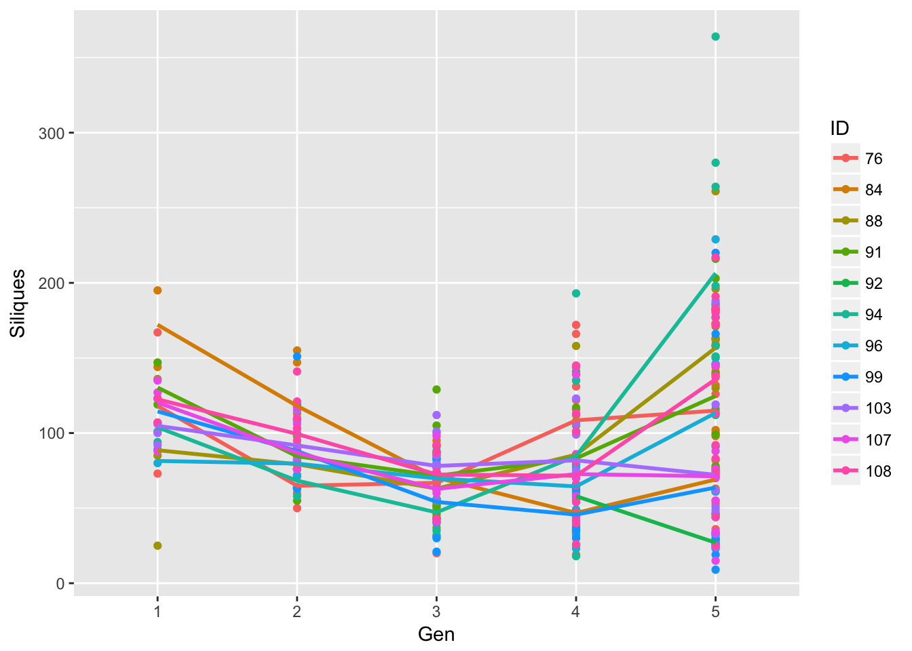

Let's look at how the residual variance scales with the mean.

```r
sil_stats <- group_by(sil_data, Gen, ID) %>%
  summarise(Mean = mean(Siliques),
            Var = var(Siliques),
            SD = sqrt(Var))
sil_stats <- sil_stats[complete.cases(sil_stats), ]
ggplot(aes(Mean, Var, color = ID), data = sil_stats) + geom_point() 
```

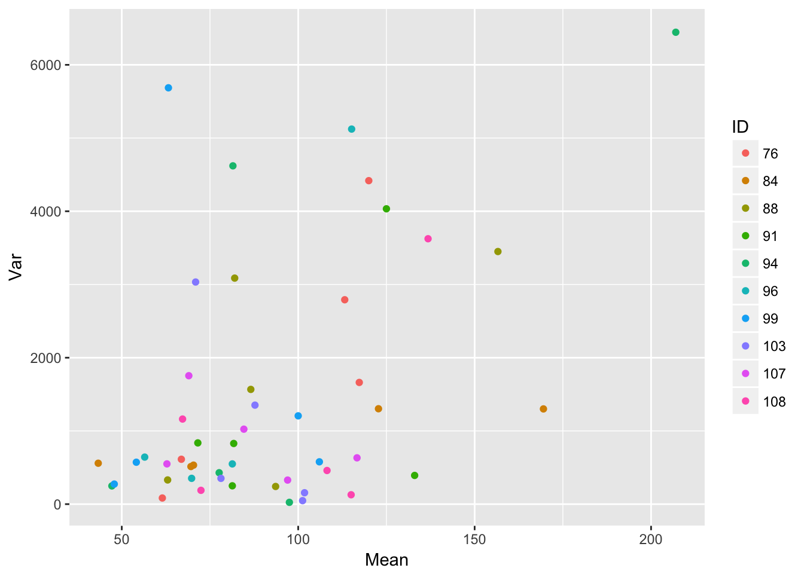

```r
ggplot(aes(Mean, SD, color = ID), data = sil_stats) + geom_point() 
```

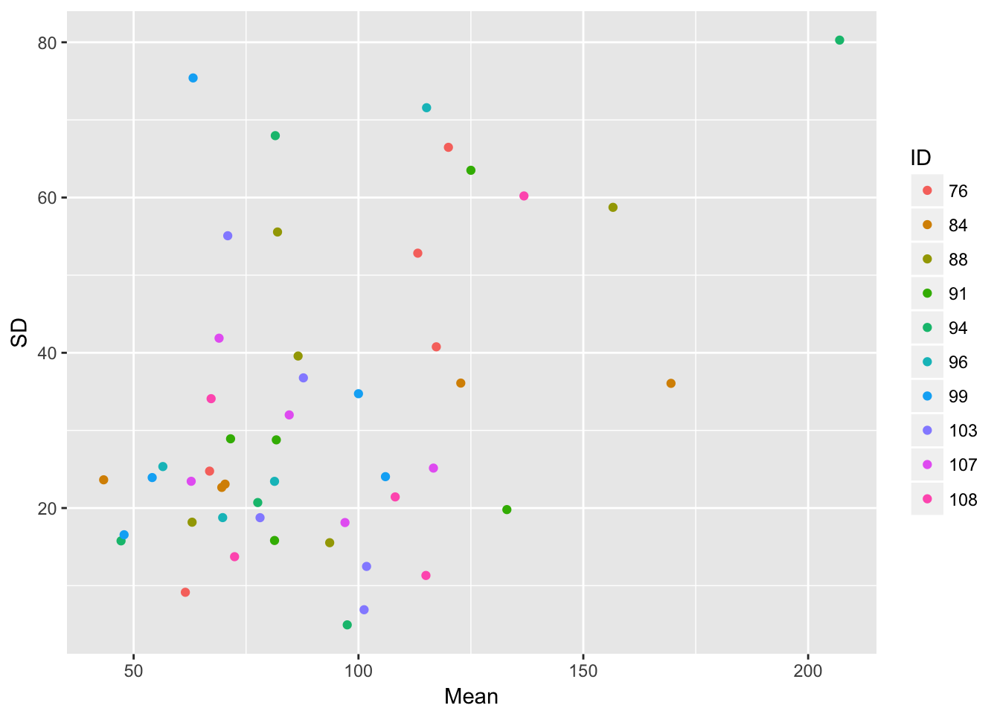

```r
ggplot(aes(Mean, Var), data = sil_stats) + geom_point() + geom_smooth(method = "lm")
```

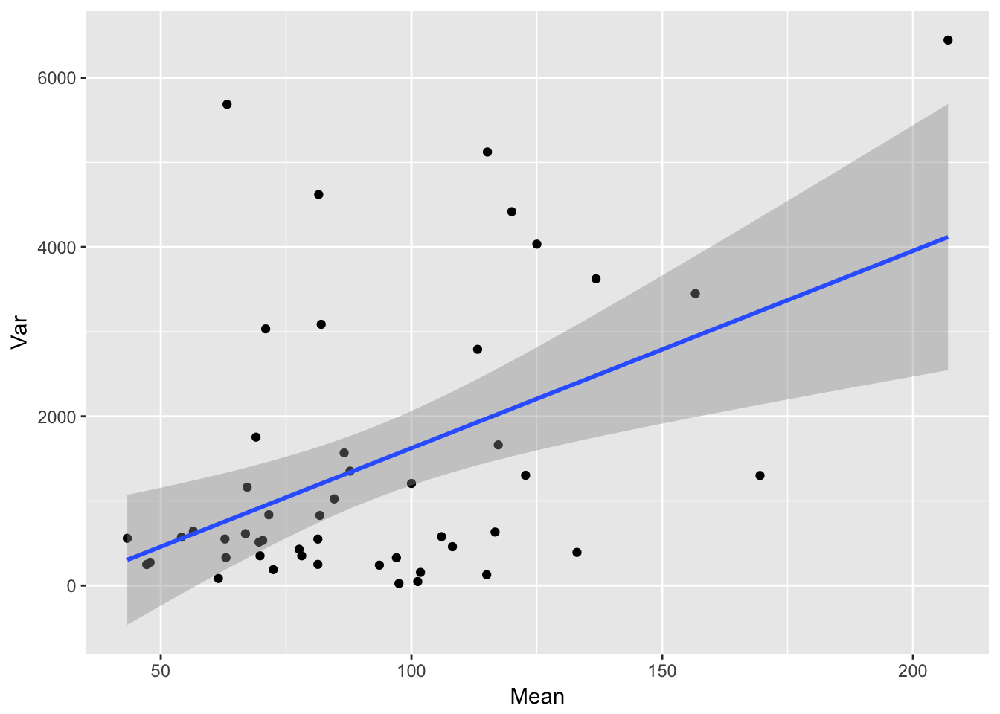

```r
ggplot(aes(Mean, SD), data = sil_stats) + geom_point() + geom_smooth(method = "lm")
```

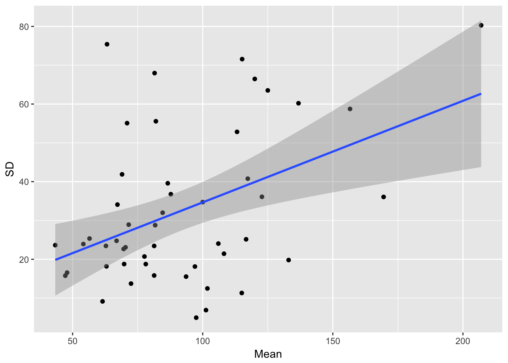

The relationship betwen the SD and mean looks a bit more linear, although there's still a lot of scatter.

Now let's see if the seed:silique ratio is structured in any way, or is independent among pots.

```r
sil_data <- subset(popLer_sil, Treatment == "B" & Gap == "3p")
sil_data$Generation <- sil_data$Generation + 1
sil_data$Gen <- as.factor(sil_data$Generation)
popLer$ID <- as.factor(popLer$ID)
sil_seed_data <- left_join(sil_data, popLer)
```

```
Joining, by = c("Generation", "ID", "Treatment", "Gap", "Pot", "Gen")
```

```
Warning in left_join_impl(x, y, by$x, by$y, suffix$x, suffix$y): joining
factors with different levels, coercing to character vector

Warning in left_join_impl(x, y, by$x, by$y, suffix$x, suffix$y): joining
factors with different levels, coercing to character vector
```

```
Warning in left_join_impl(x, y, by$x, by$y, suffix$x, suffix$y): joining
factor and character vector, coercing into character vector
```

```r
ggplot(aes(Siliques, Seedlings, color = Gen), data = sil_seed_data) + 
  geom_point() + geom_smooth(method = "lm")
```

```
Warning: Removed 2 rows containing non-finite values (stat_smooth).
```

```
Warning: Removed 2 rows containing missing values (geom_point).
```

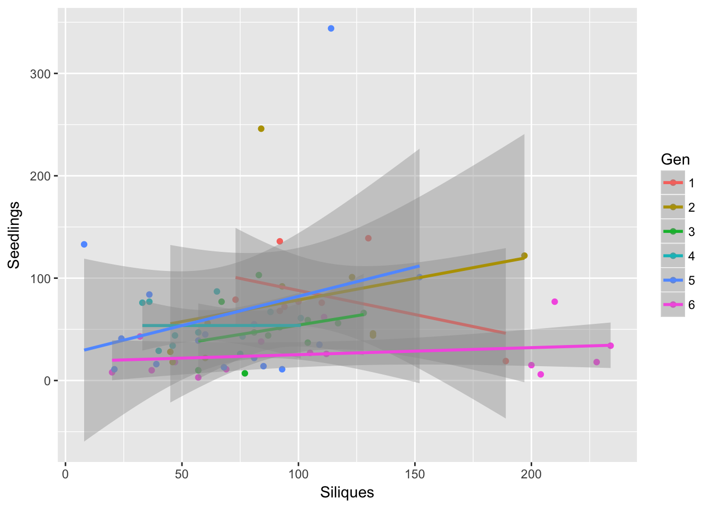

Within each generation, the number of seedlings in the home pot is independent of the number of siliques!!!

Now include the dispersing seeds in gen 1. 

```r
sil_data <- subset(popLer_sil, Treatment == "B" & Gap == "0p" & Gen == "0")
sil_data$Generation <- sil_data$Generation + 1
sil_data$Gen <- as.factor(sil_data$Generation)
Ler_seed_gen1$ID <- as.factor(Ler_seed_gen1$ID)
sil_seed_data <- left_join(sil_data, Ler_seed_gen1)
```

```
Joining, by = "ID"
```

```
Warning in left_join_impl(x, y, by$x, by$y, suffix$x, suffix$y): joining
factors with different levels, coercing to character vector
```

```r
ggplot(aes(Siliques, eff_sd_no), data = sil_seed_data) + geom_point() + 
  geom_smooth(method = "lm")
```

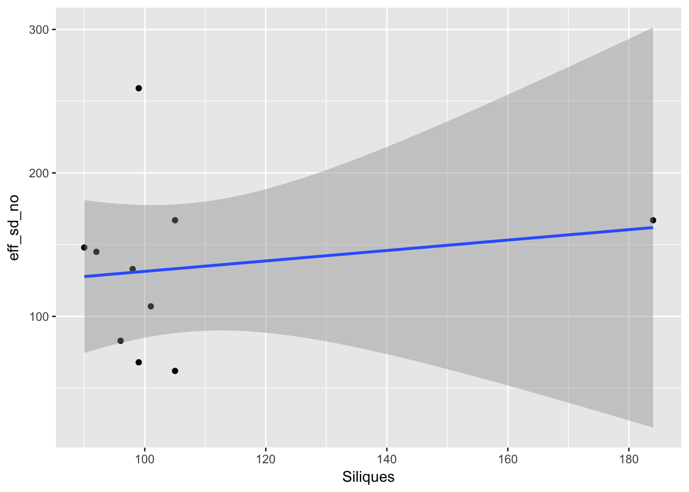

```r
ggplot(aes(Siliques, home), data = sil_seed_data) + geom_point() + 
  geom_smooth(method = "lm")
```

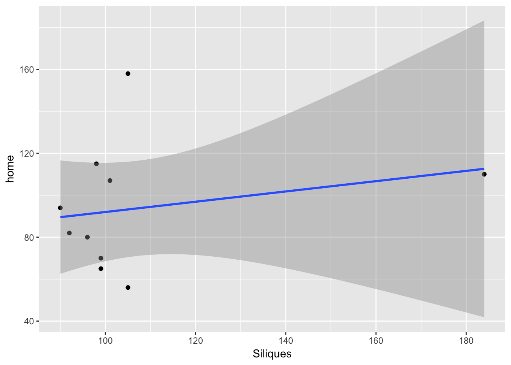

```r
ggplot(aes(Siliques, stay_prop), data = sil_seed_data) + geom_point() + 
  geom_smooth(method = "lm")
```

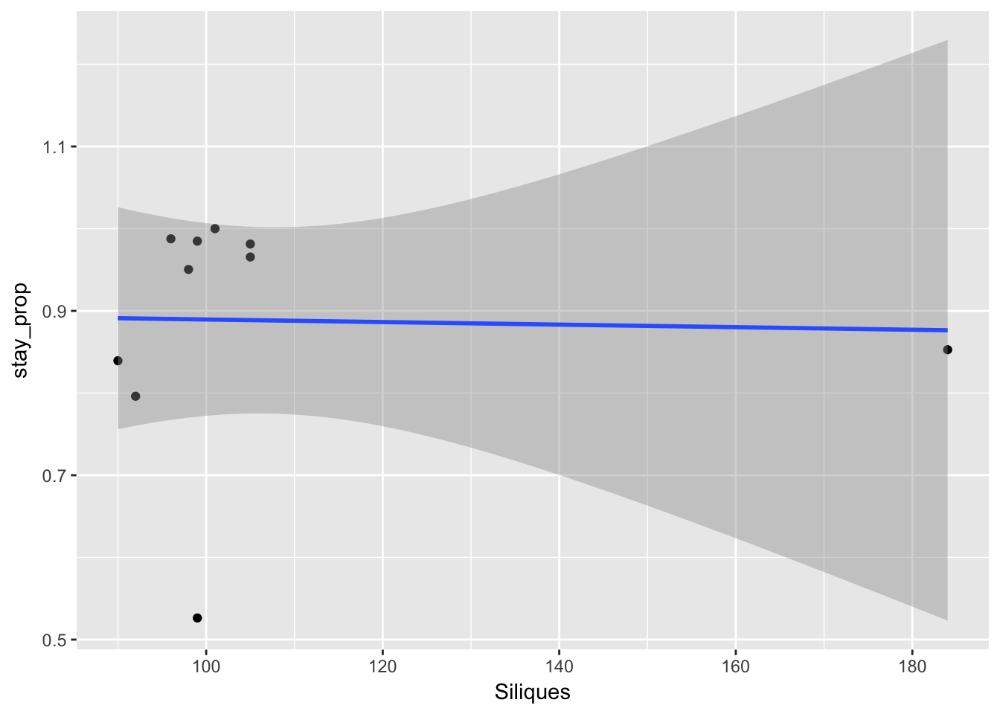

So the lack of relationship between siliques and seedling is not because of variability in dispersal.

Let's look at population structure in the variability of home pot seedlings, using the 1p gaps to get replication within populations but seedling numbers mostly from local production:


```r
seed_data <- subset(popLer, Treatment == "B" & Generation > 1 & Gap == "1p")
seed_data$GenID <- with(seed_data, interaction(Gen, ID))
summary(aov(Seedlings ~ Gen + GenID, data = seed_data)) 
```

```
            Df Sum Sq Mean Sq F value   Pr(>F)    
Gen          4  31628    7907   5.747 0.000388 ***
GenID       45 178349    3963   2.881 1.41e-05 ***
Residuals   84 115567    1376                     
---
Signif. codes:  0 '***' 0.001 '**' 0.01 '*' 0.05 '.' 0.1 ' ' 1
```

```r
ggplot(aes(Gen, Seedlings, group = ID, color = ID), data = seed_data) + geom_point() +
  geom_smooth(span = 1, se = FALSE)
```

```
`geom_smooth()` using method = 'loess'
```

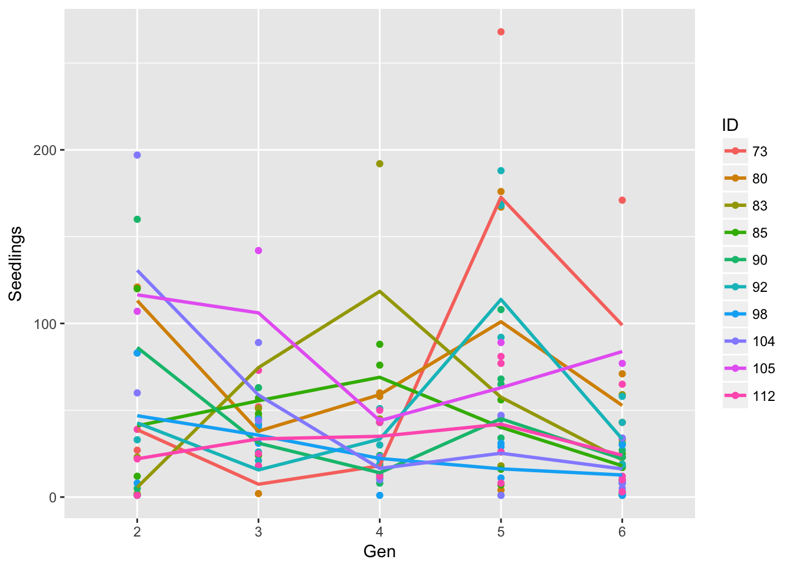

Let's look at how the residual variance scales with the mean.

```r
sil_stats <- group_by(seed_data, Gen, ID) %>%
  summarise(Mean = mean(Seedlings),
            Var = var(Seedlings),
            SD = sqrt(Var))
sil_stats <- sil_stats[complete.cases(sil_stats), ]
ggplot(aes(Mean, Var, color = ID), data = sil_stats) + geom_point() 
```

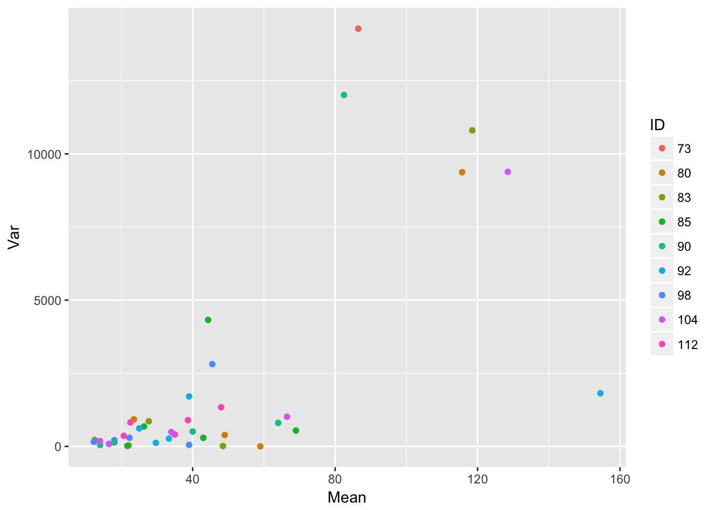

```r
ggplot(aes(Mean, SD, color = ID), data = sil_stats) + geom_point() 
```

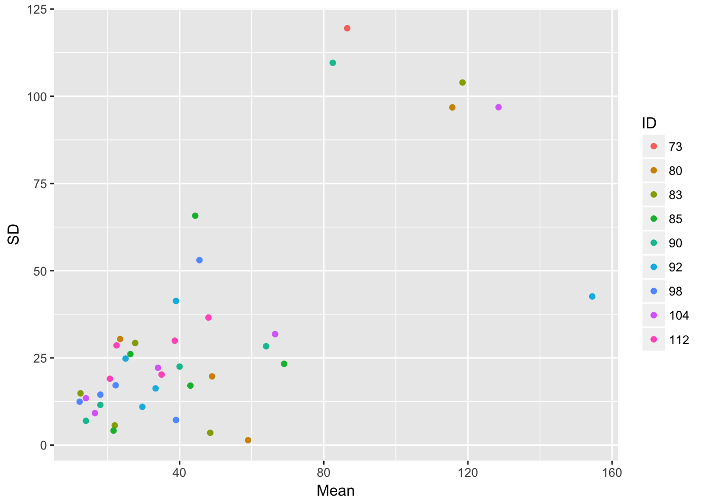

```r
ggplot(aes(Mean, Var), data = sil_stats) + geom_point() + geom_smooth(method = "lm")
```

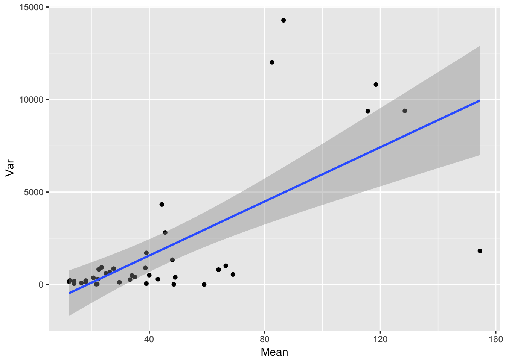

```r
ggplot(aes(Mean, SD), data = sil_stats) + geom_point() + geom_smooth(method = "lm")
```

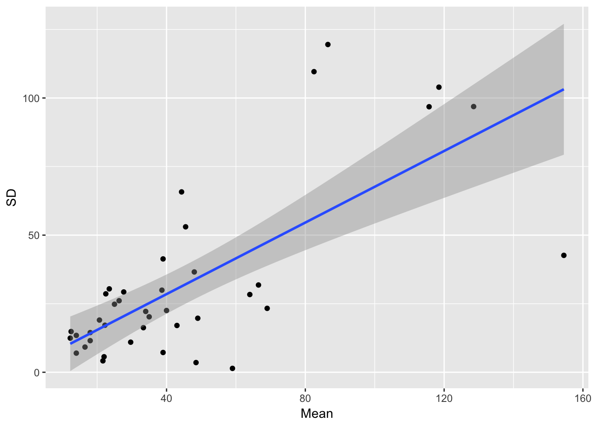
So, despite the lack of relationship between siliques and seedlings, we do see that seedling production is structured by runway, and that the SD scales roughly linearly with the mean (althoug not in a way that bives a constant CV)

We can also look at population-level structure in the density-dependent populations.

```r
seed_data <- group_by(popLer, ID, Pot) %>%
  mutate(Nm1 = lag(Seedlings))
#seed_data$Nm1 <- lag(popLer$Seedlings)
seed_data <- subset(seed_data, Treatment == "C" & Generation > 1 & Gap == "1p")
seed_data$GenID <- with(seed_data, interaction(Gen, ID))
anova(lm(log(Seedlings/Nm1) ~ log(Nm1) + Gen + GenID, data = seed_data)) 
```

```
Analysis of Variance Table

Response: log(Seedlings/Nm1)
           Df Sum Sq Mean Sq  F value    Pr(>F)    
log(Nm1)    1 359.27  359.27 750.8986 < 2.2e-16 ***
Gen         4  38.89    9.72  20.3221 1.105e-12 ***
GenID      45  33.35    0.74   1.5489    0.0328 *  
Residuals 115  55.02    0.48                       
---
Signif. codes:  0 '***' 0.001 '**' 0.01 '*' 0.05 '.' 0.1 ' ' 1
```

```r
ggplot(aes(log(Nm1), log(Seedlings/Nm1), group = GenID, color = Gen), data = seed_data) +
  geom_point() + geom_smooth(method = "lm", se = FALSE)
```

```
Warning: Removed 36 rows containing non-finite values (stat_smooth).
```

```
Warning: Removed 36 rows containing missing values (geom_point).
```

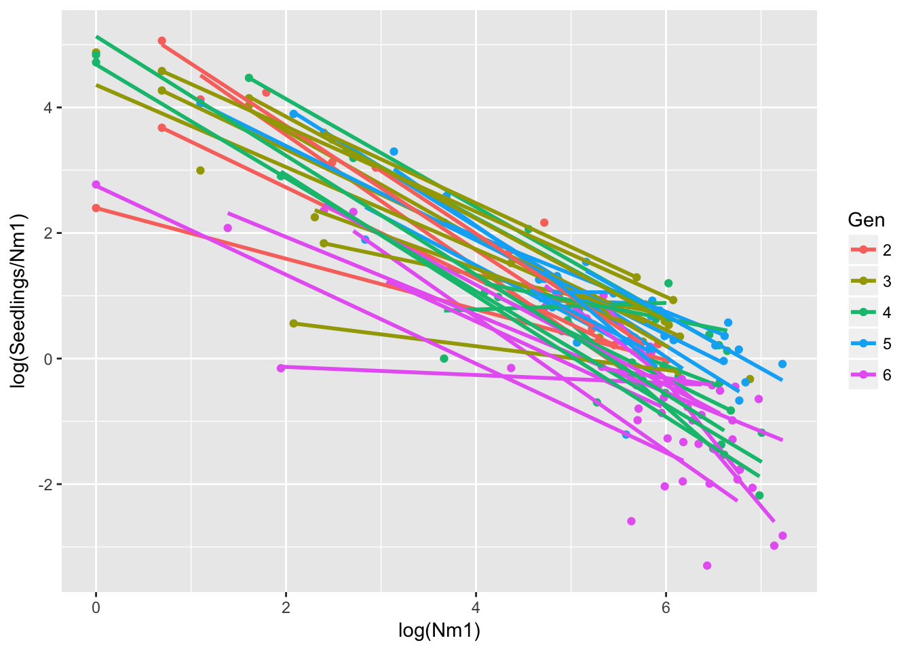
So the population-level variation is still here.
